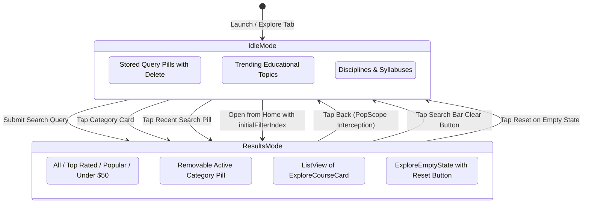
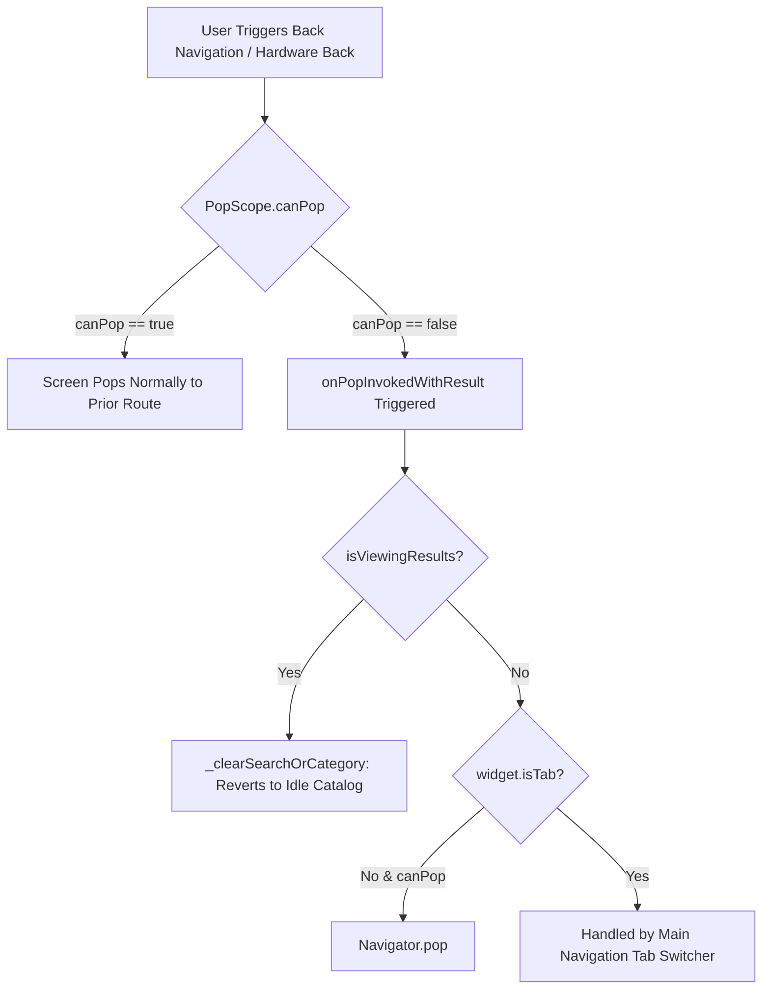

# Mobile Screen Deep-Dive: `ExploreScreen`

> **File Path:** [`apps/mobile/lib/features/catalog/presentation/screens/explore_screen.dart`](file:///d:/Programming/MonoRepo%20Porjects/EducationLab/apps/mobile/lib/features/catalog/presentation/screens/explore_screen.dart)  
> **Route Name:** `'/explore'` (Tab 1 in `MainNavigationScreen`)  
> **Scale:** 312 lines of Dart code (coordinating 7 modular presentation widgets)  
> **State Management:** `ExploreProvider`, `EnrollmentProvider`  
> **Navigation Mode:** Operates as both root Tab 1 and a pushed route with cross-tab argument initialization

---

## 1. Overview & Business Objective

`ExploreScreen` is the comprehensive course catalog, search engine, and discovery portal for the EducationLab mobile app. It implements a dual-mode responsive layout:

1. **Mode 1: Idle Catalog & Discovery:** Displayed when no active search query or category filter is set. Presents user search history (`ExploreRecentSearches`), trending platform keywords (`ExploreTopSearches`), and academic disciplinary branches (`ExploreCategoriesList`).
2. **Mode 2: Filtered Course Results Feed:** Activated as soon as the user executes a search query, selects a category, or applies a filter preset from the Home screen. Features real-time multi-criteria filter chips (`ExploreFilterBar`), active category badge dismissing, pull-to-refresh, skeleton shimmer states, and course item cards.

---

## 2. Screen Architecture & Dual-State Machine



### 2.1 State Variables & Parameters

| Variable Name | Type | Lines | Initial Value | Scope & Lifecycle Purpose |
| :--- | :--- | :--- | :--- | :--- |
| `widget.isTab` | `bool` | [:27](file:///d:/Programming/MonoRepo%20Porjects/EducationLab/apps/mobile/lib/features/catalog/presentation/screens/explore_screen.dart#L27) | `false` | Distinguishes whether the screen is embedded as Tab 1 in `MainNavigationScreen` or pushed as a standalone route. |
| `widget.autoFocusSearch` | `bool` | [:28](file:///d:/Programming/MonoRepo%20Porjects/EducationLab/apps/mobile/lib/features/catalog/presentation/screens/explore_screen.dart#L28) | `false` | When `true`, automatically focuses `_searchFocusNode` on mount and reveals the virtual keyboard. |
| `widget.initialCategory` | `CategoryItem?` | [:29](file:///d:/Programming/MonoRepo%20Porjects/EducationLab/apps/mobile/lib/features/catalog/presentation/screens/explore_screen.dart#L29) | `null` | Pre-selects a specific category passed from `HomeScreen` or banners. |
| `widget.initialSearchQuery` | `String?` | [:30](file:///d:/Programming/MonoRepo%20Porjects/EducationLab/apps/mobile/lib/features/catalog/presentation/screens/explore_screen.dart#L30) | `null` | Pre-fills the search input from popular topic pills. |
| `widget.initialFilterIndex` | `int?` | [:31](file:///d:/Programming/MonoRepo%20Porjects/EducationLab/apps/mobile/lib/features/catalog/presentation/screens/explore_screen.dart#L31) | `null` | Pre-selects quick filter chip (0: New, 1: Recommended, 2: Bestsellers). |
| `_searchController` | `TextEditingController` | [:39](file:///d:/Programming/MonoRepo%20Porjects/EducationLab/apps/mobile/lib/features/catalog/presentation/screens/explore_screen.dart#L39) | Empty | Controls query input text; synchronized bi-directionally with `ExploreProvider.searchQuery`. |
| `_searchFocusNode` | `FocusNode` | [:40](file:///d:/Programming/MonoRepo%20Porjects/EducationLab/apps/mobile/lib/features/catalog/presentation/screens/explore_screen.dart#L40) | `FocusNode()` | Manages input focus; unfocused on query clearing or submission. |

---

## 3. UI Component Hierarchy & Layout Tree

```
PopScope (canPop: !widget.isTab && !isViewingResults, onPopInvoked: _handleBack)
└── Scaffold (backgroundColor: dynamic dark/light)
    └── SafeArea (bottom: false)
        └── Column
            ├── ExploreSearchBar
            │   ├── Leading: Back Icon (in results mode) or Search Icon (idle)
            │   ├── Search TextField (with placeholder "ابحث عن الدورات، المهارات، المحاضرين...")
            │   ├── Active Category Tag (if activeCategory != null)
            │   └── Trailing: Clear Query 'X' Button or Filter Trigger
            └── Expanded: AnimatedSwitcher (260ms Smooth Slide & Fade Transition)
                ├── VIEW 1: Active Results Feed (isViewingResults == true)
                │   ├── ExploreFilterBar (Horizontal choice chips)
                │   │   ├── Chip 0: "الكل" (All Matches)
                │   │   ├── Chip 1: "الأعلى تقييماً" (Rating >= 4.7)
                │   │   ├── Chip 2: "الأكثر شعبية" (Reviews >= 20 or Bestseller)
                │   │   └── Chip 3: "أقل من $50" (Budget friendly)
                │   ├── Available Results Counter Header:
                │   │   ├── Text: "النتائج المتاحة (N)"
                │   │   └── Active Category Pill with Dismiss 'X' Button
                │   ├── Center Mini-Spinner (if provider.isLoading && results.isNotEmpty)
                │   └── Main Body Switcher:
                │       ├── State A: ExploreSkeletonLoading (Initial network load)
                │       ├── State B: ExploreEmptyState (Zero matches + "إعادة ضبط البحث" CTA)
                │       └── State C: RefreshIndicator + ListView.separated (PageStorageKey)
                │           └── ExploreCourseCard (Thumbnail, rating, title, instructor, price)
                └── VIEW 2: Idle Catalog Matrix (isViewingResults == false)
                    └── ListView (PageStorageKey: 'explore_main_categories_list')
                        ├── ExploreRecentSearches (Recent query tags with individual & clear all)
                        ├── ExploreTopSearches (Trending keywords tags)
                        └── ExploreCategoriesList (Disciplinary cards with course counts)
```

---

## 4. Back Navigation & Gesture Interception (`PopScope`)

`ExploreScreen` overrides the Android hardware back button and iOS edge-swipe pop gestures using Flutter's modern `PopScope` API to prevent accidental app exits:



---

## 5. Method Catalog & Action Handlers

| Method Name | Signature | Lines | Description & Mutations |
| :--- | :--- | :--- | :--- |
| `_onSearchSubmit` | `void _onSearchSubmit(String query)` | [:72-76](file:///d:/Programming/MonoRepo%20Porjects/EducationLab/apps/mobile/lib/features/catalog/presentation/screens/explore_screen.dart#L72-L76) | Trims query string and delegates to `ExploreProvider.onSearchSubmitted(clean)`. |
| `_applySearchQuery` | `void _applySearchQuery(String text)` | [:78-81](file:///d:/Programming/MonoRepo%20Porjects/EducationLab/apps/mobile/lib/features/catalog/presentation/screens/explore_screen.dart#L78-L81) | Updates `_searchController.text` and triggers search execution. Used by recent and top search tag clicks. |
| `_openCategory` | `void _openCategory(CategoryItem category)` | [:83-86](file:///d:/Programming/MonoRepo%20Porjects/EducationLab/apps/mobile/lib/features/catalog/presentation/screens/explore_screen.dart#L83-L86) | Clears search text and instructs `ExploreProvider` to enter results mode filtered to the selected category. |
| `_clearSearchOrCategory` | `void _clearSearchOrCategory()` | [:88-92](file:///d:/Programming/MonoRepo%20Porjects/EducationLab/apps/mobile/lib/features/catalog/presentation/screens/explore_screen.dart#L88-L92) | Clears text input, removes keyboard focus, and invokes `ExploreProvider.clearFilters()` to return to the idle catalog. |
| `_handleBack` | `void _handleBack()` | [:94-102](file:///d:/Programming/MonoRepo%20Porjects/EducationLab/apps/mobile/lib/features/catalog/presentation/screens/explore_screen.dart#L94-L102) | Provides tactile feedback and clears search results if active; otherwise pops route if opened as a pushed screen. |

---

## 6. Dynamic Inset Calculations & Floating Mini-Bar Resilience

`ExploreScreen` dynamically calculates bottom scroll insets to avoid content obstruction caused by the persistent floating navigation bar and the [`ContinueLearningMiniBar`](file:///d:/Programming/MonoRepo%20Porjects/EducationLab/apps/mobile/lib/core/widgets/continue_learning_mini_bar.dart):

```dart
final bool hasContinueLearning = enrollmentProvider.courses.isNotEmpty;
final double bottomInset = MediaQuery.paddingOf(context).bottom;
final double bottomPadding = widget.isTab
    ? (hasContinueLearning ? 180.0 : 100.0) + bottomInset
    : 24.0 + bottomInset;
```
* If learner is actively enrolled in courses, bottom padding expands to `180.0 + insets` to grant full clearance over the resume-learning bar.
* If no courses are in progress, bottom padding remains `100.0 + insets` to accommodate the floating bottom navigation bar.
* If pushed as an independent route (`isTab: false`), standard padding of `24.0 + insets` is applied.
