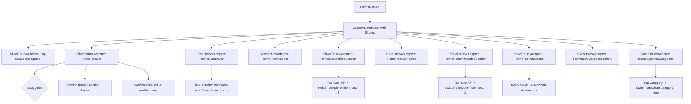
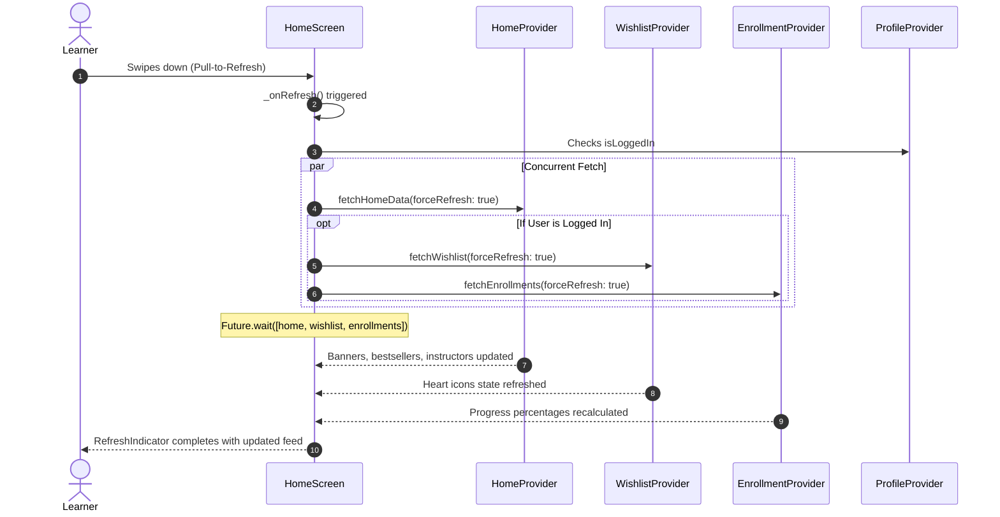

# Mobile Screen Deep-Dive: `HomeScreen`

> **File Path:** [`apps/mobile/lib/features/home/presentation/screens/home_screen.dart`](file:///d:/Programming/MonoRepo%20Porjects/EducationLab/apps/mobile/lib/features/home/presentation/screens/home_screen.dart)  
> **Route Name:** Tab 0 in `MainNavigationScreen` (`'/main'`)  
> **Scale:** 222 lines of Dart code (coordinating 9 modular presentation widgets)  
> **State Management:** `HomeProvider`, `EnrollmentProvider`, `WishlistProvider`, `ProfileProvider`, `ExploreProvider`  
> **Layout Architecture:** Performant Slivers inside `CustomScrollView` with `AlwaysScrollableScrollPhysics` and `BouncingScrollPhysics`

---

## 1. Overview & Business Objective

`HomeScreen` serves as the commercial and discovery storefront for the EducationLab mobile experience. It is designed to maximize student engagement and conversion through personalized recommendations, dynamic marketing banners, bestselling course carousels, and quick category filtering.

Key capabilities:
1. **Zero-Lag Sliver Scrolling:** Entire feed is organized inside a unified `CustomScrollView` using `SliverToBoxAdapter` components, allowing the status bar spacer, headers, and carousels to scroll smoothly without scroll-nesting stutter.
2. **Concurrent Multi-Provider Refresh:** Implements `Future.wait` across `HomeProvider`, `WishlistProvider`, and `EnrollmentProvider` on pull-to-refresh to maintain data freshness across all tabs in a single network round-trip.
3. **Deep Cross-Tab Transitions:** Search bar and category tiles intelligently cross-navigate to Tab 1 (Explore) using `MainNavigationScreen.switchToExplore(...)`, injecting category objects or search autofocus directives without recreating screen instances.

---

## 2. Screen Architecture & Modular Composition

### 2.1 State Variables & Parameters

| Variable Name | Type | Lines | Initial Value | Scope & Lifecycle Purpose |
| :--- | :--- | :--- | :--- | :--- |
| `widget.isLoggedIn` | `bool` | [:25](file:///d:/Programming/MonoRepo%20Porjects/EducationLab/apps/mobile/lib/features/home/presentation/screens/home_screen.dart#L25) | `false` | Informs `HomeHeader` whether to display student avatar or guest login button. |
| `widget.userName` | `String` | [:26](file:///d:/Programming/MonoRepo%20Porjects/EducationLab/apps/mobile/lib/features/home/presentation/screens/home_screen.dart#L26) | `''` | User display name rendered in personalized greeting header. |

---

## 3. Modular Section Catalog

`HomeScreen` delegates rendering to 9 specialized widgets:

| Section Widget | File Location | Purpose & Functionality |
| :--- | :--- | :--- |
| [`HomeHeader`](file:///d:/Programming/MonoRepo%20Porjects/EducationLab/apps/mobile/lib/features/home/presentation/widgets/home_header.dart) | `widgets/home_header.dart` | Renders brand identity, current student avatar, greeting text ("مرحباً بك مجدداً"), and notification icon badge. |
| [`HomeSearchBar`](file:///d:/Programming/MonoRepo%20Porjects/EducationLab/apps/mobile/lib/features/home/presentation/widgets/home_search_bar.dart) | `widgets/home_search_bar.dart` | Visual search placeholder; tapping triggers instant transition to Explore tab with keyboard opened. |
| [`HomePromoSlider`](file:///d:/Programming/MonoRepo%20Porjects/EducationLab/apps/mobile/lib/features/home/presentation/widgets/home_promo_slider.dart) | `widgets/home_promo_slider.dart` | PageView carousel with auto-scrolling promotional marketing banners, discount tags, and CTA buttons. |
| [`HomeBestsellersSection`](file:///d:/Programming/MonoRepo%20Porjects/EducationLab/apps/mobile/lib/features/home/presentation/widgets/home_bestsellers_section.dart) | `widgets/home_bestsellers_section.dart` | Horizontal ListView of top-enrolled platform courses with enroll count tags. |
| [`HomePopularTopics`](file:///d:/Programming/MonoRepo%20Porjects/EducationLab/apps/mobile/lib/features/home/presentation/widgets/home_popular_topics.dart) | `widgets/home_popular_topics.dart` | Horizontal pill wrap of trending search tags (e.g., Flutter, AI, DevOps, React) routing directly into search queries. |
| [`HomeRecommendedSection`](file:///d:/Programming/MonoRepo%20Porjects/EducationLab/apps/mobile/lib/features/home/presentation/widgets/home_recommended_section.dart) | `widgets/home_recommended_section.dart` | Personalized course suggestions matching learner's active category interests. |
| [`HomeTopInstructors`](file:///d:/Programming/MonoRepo%20Porjects/EducationLab/apps/mobile/lib/features/home/presentation/widgets/home_top_instructors.dart) | `widgets/home_top_instructors.dart` | Circular avatar cards of distinguished platform professors with student counts and ratings. |
| [`HomeNewCoursesSection`](file:///d:/Programming/MonoRepo%20Porjects/EducationLab/apps/mobile/lib/features/home/presentation/widgets/home_new_courses_section.dart) | `widgets/home_new_courses_section.dart` | Recently uploaded syllabuses showcasing new course release badges. |
| [`HomeExploreCategories`](file:///d:/Programming/MonoRepo%20Porjects/EducationLab/apps/mobile/lib/features/home/presentation/widgets/home_explore_categories.dart) | `widgets/home_explore_categories.dart` | Two-column grid of academic categories with icons, color coding, and course counters. |

---

## 4. Multi-Provider Pull-to-Refresh Pipeline

---

## 5. Security & Edge Case Resilience

1. **Guest Browsing Resilience:**
   * When `isLoggedIn = false`, wishlist and enrollment sync calls are skipped in `_onRefresh()`, avoiding invalid 401 token authentication requests to the API.
2. **Category Model Fallbacks:**
   * When tapping an unmapped category card, `findOrCreateCategory()` dynamically constructs a fallback category object with sane defaults (default primary color, placeholder icon, and zero count) to prevent null reference crashes during tab transitions.
3. **Scroll Momentum Isolation:**
   * Uses `AlwaysScrollableScrollPhysics(parent: BouncingScrollPhysics())`, ensuring that even when content height is less than the viewport height, pull-to-refresh remains functional.
