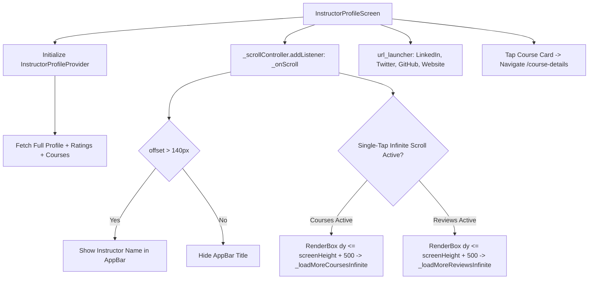

# Mobile Screen Deep-Dive: `InstructorProfileScreen`

> **File Path:** [`apps/mobile/lib/features/home/presentation/screens/instructor_profile_screen.dart`](file:///d:/Programming/MonoRepo%20Porjects/EducationLab/apps/mobile/lib/features/home/presentation/screens/instructor_profile_screen.dart)  
> **Route Name:** `'/instructor-profile'`  
> **Scale:** 2,734 lines of Dart code  
> **State Management:** `InstructorProfileProvider`  
> **External Integrations:** `url_launcher` (LinkedIn, Twitter, GitHub, YouTube, Website)  
> **Key Capabilities:** Single-Tap Infinite Scroll for Courses & Reviews, Dynamic Collapsing Header, Rating Distribution Bars

---

## 1. Overview & Business Objective

`InstructorProfileScreen` presents an exhaustive academic and professional showcase for a specific platform instructor. It enables prospective students to evaluate instructor credentials, browse published syllabuses, inspect student reviews, and connect via verified social channels.

Key features:
1. **Dynamic Collapsing Navigation Bar:** Scroll listener (`_scrollController`) tracks viewport offset, dynamically transitioning the AppBar from transparent/surface to solid brand styling and revealing the instructor's name once offset exceeds 140px.
2. **Single-Tap Infinite Scroll Architecture:** Employs a custom viewport inspection technique (`RenderBox.localToGlobal`) bound to `GlobalKey _coursesBottomKey` and `_reviewsBottomKey`. Once activated via a single tap on the "عرض المزيد" CTA, it unlocks continuous infinite scrolling as the user reaches within 500px of the footer.
3. **Comprehensive Ratings & Review Breakdown:** Renders cumulative rating averages, total student reviews, and percentage distribution bars across 1 to 5 stars.
4. **Interactive Syllabuses Feed:** Filterable catalog of the instructor's published courses with direct routing into [`CourseDetailsScreen`](file:///d:/Programming/MonoRepo%20Porjects/EducationLab/Documentation/Modules/Mobile/Screens/CourseDetailsScreen.md).
5. **Verified Social Channel Launchers:** Direct external app/web redirection via `url_launcher` for LinkedIn, GitHub, YouTube, X (Twitter), and personal portfolios.

---

## 2. Screen Architecture & State Machine



### 2.1 State Variables Registry

| Variable Name | Type | Lines | Initial Value | Scope & Lifecycle Purpose |
| :--- | :--- | :--- | :--- | :--- |
| `_provider` | `InstructorProfileProvider` | [:31](file:///d:/Programming/MonoRepo%20Porjects/EducationLab/apps/mobile/lib/features/home/presentation/screens/instructor_profile_screen.dart#L31) | Local Provider | Dedicated provider handling profile data, course pagination, and reviews. |
| `_scrollController` | `ScrollController` | [:32](file:///d:/Programming/MonoRepo%20Porjects/EducationLab/apps/mobile/lib/features/home/presentation/screens/instructor_profile_screen.dart#L32) | `ScrollController()` | Manages collapsing AppBar title and viewport triggers. |
| `_isBioExpanded` | `bool` | [:33](file:///d:/Programming/MonoRepo%20Porjects/EducationLab/apps/mobile/lib/features/home/presentation/screens/instructor_profile_screen.dart#L33) | `false` | Toggles "قراءة المزيد" / "عرض أقل" on instructor autobiography text. |
| `_showAppBarTitle` | `bool` | [:34](file:///d:/Programming/MonoRepo%20Porjects/EducationLab/apps/mobile/lib/features/home/presentation/screens/instructor_profile_screen.dart#L34) | `false` | Toggles AppBar instructor title visibility based on scroll offset > 140px. |
| `_coursesPageSize` | `static const int` | [:38](file:///d:/Programming/MonoRepo%20Porjects/EducationLab/apps/mobile/lib/features/home/presentation/screens/instructor_profile_screen.dart#L38) | `4` | Initial number of courses rendered before triggering pagination. |
| `_displayedCoursesCount` | `int` | [:39](file:///d:/Programming/MonoRepo%20Porjects/EducationLab/apps/mobile/lib/features/home/presentation/screens/instructor_profile_screen.dart#L39) | `4` | Current count of slice-rendered course items. |
| `_isCoursesInfiniteScrollActive` | `bool` | [:40](file:///d:/Programming/MonoRepo%20Porjects/EducationLab/apps/mobile/lib/features/home/presentation/screens/instructor_profile_screen.dart#L40) | `false` | Activated by single tap on "تفعيل التمرير اللانهائي", enabling auto-pagination. |
| `_isLoadingMoreCourses` | `bool` | [:41](file:///d:/Programming/MonoRepo%20Porjects/EducationLab/apps/mobile/lib/features/home/presentation/screens/instructor_profile_screen.dart#L41) | `false` | Loading spinner flag displayed at the bottom of the course list. |
| `_coursesBottomKey` | `GlobalKey` | [:42](file:///d:/Programming/MonoRepo%20Porjects/EducationLab/apps/mobile/lib/features/home/presentation/screens/instructor_profile_screen.dart#L42) | `GlobalKey()` | Coordinates viewport position detection for course lazy-loading. |
| `_reviewsPageSize` | `static const int` | [:45](file:///d:/Programming/MonoRepo%20Porjects/EducationLab/apps/mobile/lib/features/home/presentation/screens/instructor_profile_screen.dart#L45) | `3` | Initial number of student reviews rendered. |
| `_displayedReviewsCount` | `int` | [:46](file:///d:/Programming/MonoRepo%20Porjects/EducationLab/apps/mobile/lib/features/home/presentation/screens/instructor_profile_screen.dart#L46) | `3` | Current count of slice-rendered review items. |
| `_isReviewsInfiniteScrollActive` | `bool` | [:47](file:///d:/Programming/MonoRepo%20Porjects/EducationLab/apps/mobile/lib/features/home/presentation/screens/instructor_profile_screen.dart#L47) | `false` | Enables continuous review pagination upon initial tap. |
| `_isLoadingMoreReviews` | `bool` | [:48](file:///d:/Programming/MonoRepo%20Porjects/EducationLab/apps/mobile/lib/features/home/presentation/screens/instructor_profile_screen.dart#L48) | `false` | Loading spinner flag displayed at the bottom of the review list. |
| `_reviewsBottomKey` | `GlobalKey` | [:49](file:///d:/Programming/MonoRepo%20Porjects/EducationLab/apps/mobile/lib/features/home/presentation/screens/instructor_profile_screen.dart#L49) | `GlobalKey()` | Coordinates viewport position detection for review lazy-loading. |

---

## 3. UI Component Hierarchy & Layout Tree

```
Scaffold (backgroundColor: dynamic dark/light)
├── AppBar
│   ├── Leading: Back arrow button
│   ├── Title: AnimatedOpacity (_showAppBarTitle: Instructor Full Name)
│   └── Actions: Share Profile Action Button
└── Body: SingleChildScrollView (ScrollController: _scrollController)
    ├── SECTION 1: Instructor Hero Header
    │   ├── Large Circular Avatar with Verified Badge Overlay
    │   ├── Instructor Full Name (Bold 20px)
    │   ├── Professional Title & Academic Credentials
    │   ├── Stats Ribbon:
    │   │   ├── Metric 1: Rating (e.g. 4.9 ★)
    │   │   ├── Metric 2: Total Students Enrolled (e.g. 45,210)
    │   │   └── Metric 3: Total Courses Published (e.g. 14)
    │   └── Social Media Links Bar (Row of FontAwesome icons: LinkedIn, GitHub, etc.)
    ├── SECTION 2: Biography & About Instructor
    │   ├── Section Header: "نبذة عن المحاضر"
    │   ├── Expandable Bio Text (truncated to 4 lines if !_isBioExpanded)
    │   └── "قراءة المزيد" / "عرض أقل" TextButton
    ├── SECTION 3: Courses Published by Instructor
    │   ├── Header: "الدورات التعليمية (N)"
    │   ├── Courses List (Slices of _displayedCoursesCount items):
    │   │   └── Course Card (Thumbnail, Title, Category, Rating, Price)
    │   ├── Container with Key: _coursesBottomKey
    │   ├── Bottom Course Loader (if _isLoadingMoreCourses)
    │   └── Single-Tap Infinite Scroll Activator Button
    └── SECTION 4: Student Reviews & Academic Ratings
        ├── Header: "تقييمات وآراء الطلاب"
        ├── Rating Overview Breakdown:
        │   ├── Large Rating Score (e.g. "4.8") + 5 Yellow Stars
        │   └── 5 Horizontal Percentage Bars (5★, 4★, 3★, 2★, 1★)
        ├── Reviews List (Slices of _displayedReviewsCount items):
        │   └── Student Review Tile:
        │       ├── Student Avatar & Name
        │       ├── Star Rating + Relative Date
        │       └── Review Comment Text
        ├── Container with Key: _reviewsBottomKey
        ├── Bottom Review Loader (if _isLoadingMoreReviews)
        └── Single-Tap Infinite Scroll Activator Button for Reviews
```

---

## 4. Method Catalog & Action Handlers

| Method Name | Signature | Lines | Description & Mutations |
| :--- | :--- | :--- | :--- |
| `_onScroll` | `void _onScroll()` | [:58-67](file:///d:/Programming/MonoRepo%20Porjects/EducationLab/apps/mobile/lib/features/home/presentation/screens/instructor_profile_screen.dart#L58-L67) | Updates `_showAppBarTitle` when offset > 140px, and triggers `_checkAndTriggerInfiniteScroll()`. |
| `_checkAndTriggerInfiniteScroll` | `void _checkAndTriggerInfiniteScroll()` | [:69-110](file:///d:/Programming/MonoRepo%20Porjects/EducationLab/apps/mobile/lib/features/home/presentation/screens/instructor_profile_screen.dart#L69-L110) | Inspects RenderBox global coordinates of `_coursesBottomKey` and `_reviewsBottomKey`. If within 500px of screen bottom, triggers pagination. |
| `_loadMoreCoursesInfinite` | `void _loadMoreCoursesInfinite() async` | Custom | Increments `_displayedCoursesCount` by `_coursesPageSize` with simulated delay and haptic feedback. |
| `_loadMoreReviewsInfinite` | `void _loadMoreReviewsInfinite() async` | Custom | Increments `_displayedReviewsCount` by `_reviewsPageSize` with simulated delay and haptic feedback. |

---

## 5. Security & Edge Case Resilience

1. **Safe External Link Execution:**
   * Uses `canLaunchUrl(uri)` before invoking `launchUrl(uri, mode: LaunchMode.externalApplication)`. Malformed URLs or unsupported protocols fail gracefully without crashing.
2. **Scroll Controller Memory Hygiene:**
   * Removes `_onScroll` listener and disposes `_scrollController` in `dispose()`.
3. **RenderBox Geometry Safety:**
   * Coordinates inspection checks `box != null && box.hasSize` before invoking `box.localToGlobal()`, completely preventing layout-pass crash exceptions.
