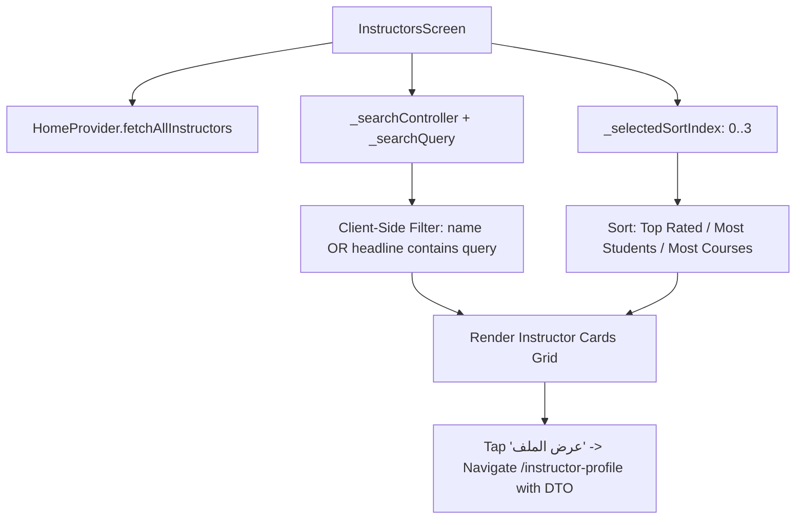
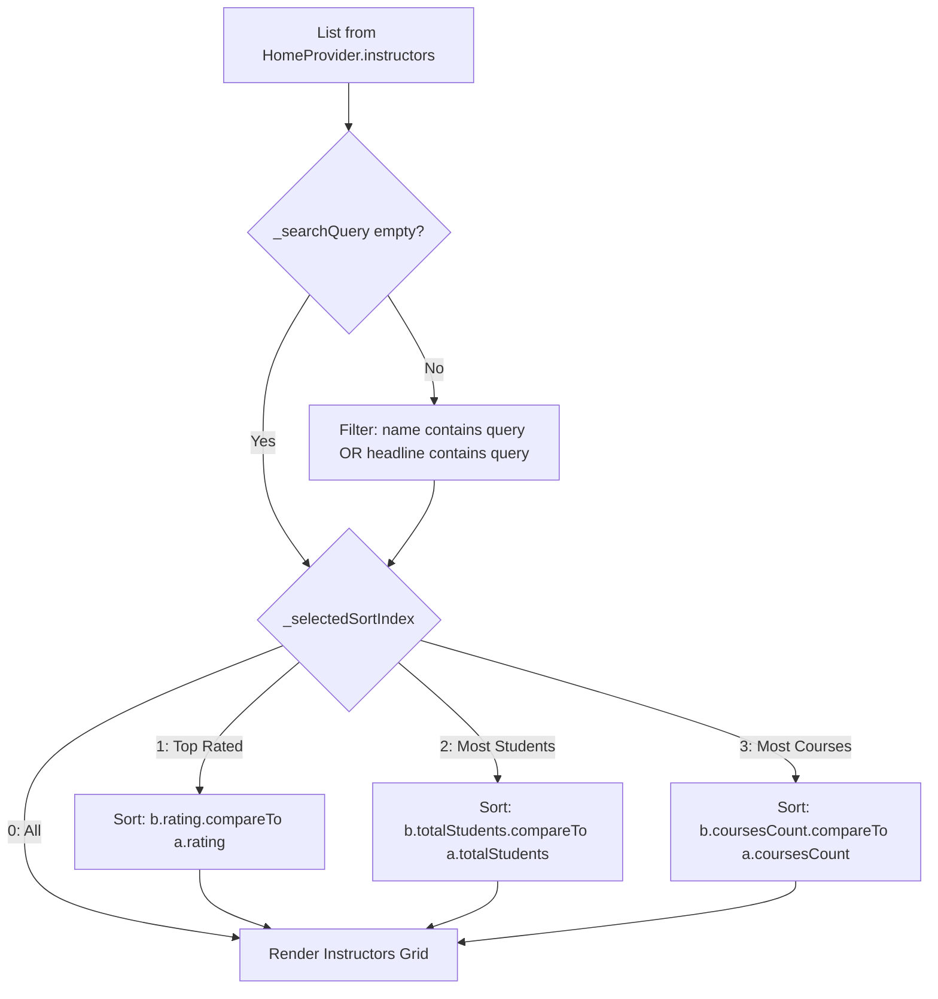

# Mobile Screen Deep-Dive: `InstructorsScreen`

> **File Path:** [`apps/mobile/lib/features/home/presentation/screens/instructors_screen.dart`](file:///d:/Programming/MonoRepo%20Porjects/EducationLab/apps/mobile/lib/features/home/presentation/screens/instructors_screen.dart)  
> **Route Name:** `'/instructors'`  
> **Scale:** 599 lines of Dart code  
> **State Management:** `HomeProvider`  
> **Layout Architecture:** Search Header, Horizontal Sorting Chips, Responsive Faculty Cards Grid

---

## 1. Overview & Business Objective

`InstructorsScreen` provides students with a searchable, categorized directory of verified faculty members, professors, and industry experts teaching on EducationLab.

Key capabilities:
1. **Live Search Filtering:** Real-time client-side search across instructor names and professional headlines (`headline`), instantly filtering results as the user types.
2. **Multi-Criteria Sorting Engine:** Sorts instructors dynamically by:
   * **الكل (All):** Default platform ranking.
   * **الأعلى تقييماً (Top Rated):** Orders by descending 5-star rating score (`rating`).
   * **الأكثر طلاباً (Most Students):** Orders by total enrolled student headcount (`totalStudents`).
   * **الأكثر دورات (Most Courses):** Orders by syllabus count published on the platform (`coursesCount`).
3. **Rich Faculty Cards:** Displays cached instructor avatars with shimmer fallbacks, verified blue credentials badges, headline disciplines, star ratings with total reviews, student count tags, and direct routing into [`InstructorProfileScreen`](file:///d:/Programming/MonoRepo%20Porjects/EducationLab/apps/mobile/lib/features/home/presentation/screens/instructor_profile_screen.dart).
4. **Shimmer Skeleton Loading:** Integrated `AppSkeleton` placeholders while `HomeProvider.fetchAllInstructors()` resolves.

---

## 2. Screen Architecture & State Machine



### 2.1 State Variables Registry

| Variable Name | Type | Lines | Initial Value | Scope & Lifecycle Purpose |
| :--- | :--- | :--- | :--- | :--- |
| `_searchController` | `TextEditingController` | [:19](file:///d:/Programming/MonoRepo%20Porjects/EducationLab/apps/mobile/lib/features/home/presentation/screens/instructors_screen.dart#L19) | Empty | Controls the directory search text field; disposed in `dispose()`. |
| `_searchQuery` | `String` | [:20](file:///d:/Programming/MonoRepo%20Porjects/EducationLab/apps/mobile/lib/features/home/presentation/screens/instructors_screen.dart#L20) | `''` | Local query string driving real-time substring matches. |
| `_selectedSortIndex` | `int` | [:21](file:///d:/Programming/MonoRepo%20Porjects/EducationLab/apps/mobile/lib/features/home/presentation/screens/instructors_screen.dart#L21) | `0` | Active sort chip index (0: All, 1: Top Rated, 2: Most Students, 3: Most Courses). |

---

## 3. UI Component Hierarchy & Layout Tree

```
Scaffold (backgroundColor: dynamic dark/light)
├── AppBar
│   ├── Leading: Localized chevron back button (iOS/Android styled)
│   └── Title: "نخبة المحاضرين" / "Top Instructors"
└── Body: Column
    ├── SECTION 1: Search Header Container
    │   └── Search TextField:
    │       ├── Prefix: Search Icon
    │       ├── Hint: "ابحث عن محاضر أو تخصص..."
    │       └── Suffix: Clear 'X' button (visible when query not empty)
    ├── SECTION 2: Horizontal Sorting Chips Bar
    │   └── ListView (horizontal scroll, 4 ChoiceChips):
    │       ├── Chip 0: "الكل"
    │       ├── Chip 1: "الأعلى تقييماً"
    │       ├── Chip 2: "الأكثر طلاباً"
    │       └── Chip 3: "الأكثر دورات"
    └── SECTION 3: Content Body (AnimatedSwitcher)
        ├── State A (Loading): Shimmer Skeleton Cards Grid (AppSkeleton)
        ├── State B (Empty): Empty State Illustration + "لم يتم العثور على محاضرين"
        └── State C (Success): RefreshIndicator + GridView / ListView
            └── Instructor Card:
                ├── Circular Avatar with CachedNetworkImage & Border
                ├── Verified Blue Checkmark Badge
                ├── Full Name (Bold Tajawal 15px)
                ├── Professional Headline (e.g. "Senior Cloud Architect • Google")
                ├── Metrics Row:
                │   ├── Star Icon + Rating (e.g. "4.9") + Reviews Count
                │   ├── Students Icon + Total Students (e.g. "12,450 طالب")
                │   └── Course Icon + Courses Count (e.g. "18 دورة")
                └── Primary Action Button: "عرض الملف الشخصي" -> /instructor-profile
```

---

## 4. Filtering & Sorting Pipeline



---

## 5. Security, Validation & Edge Cases

1. **RTL & Localization Mirroring:**
   * Back button dynamically flips between `Icons.arrow_back_ios_new_rounded` (Arabic RTL) and `Icons.arrow_forward_ios_rounded` (English LTR).
2. **Avatar Image Resilience:**
   * Uses `CachedNetworkImage` with fallback initials or generic avatar graphic to handle network timeouts or broken image URLs gracefully.
3. **Empty Results Recovery:**
   * Provides an instant "مسح البحث" (Reset Search) action inside the empty state view to restore the complete faculty catalog without navigating away.
