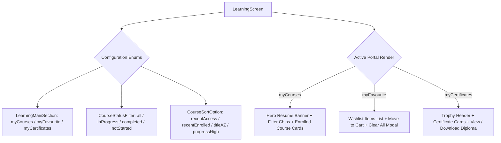
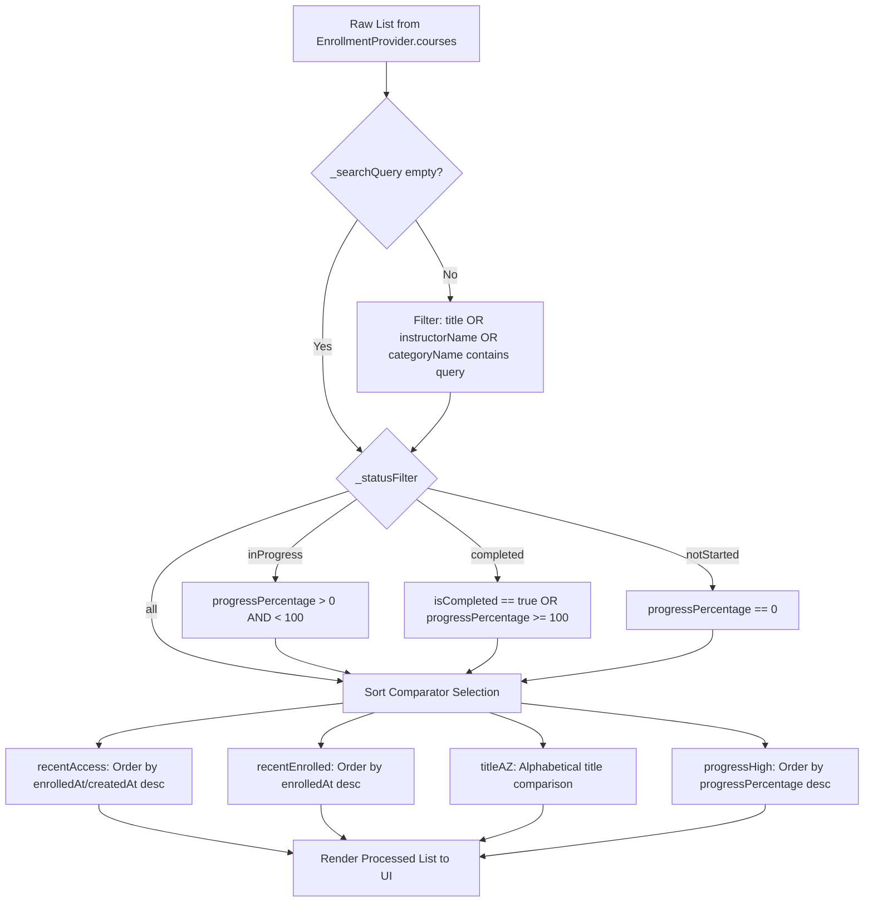
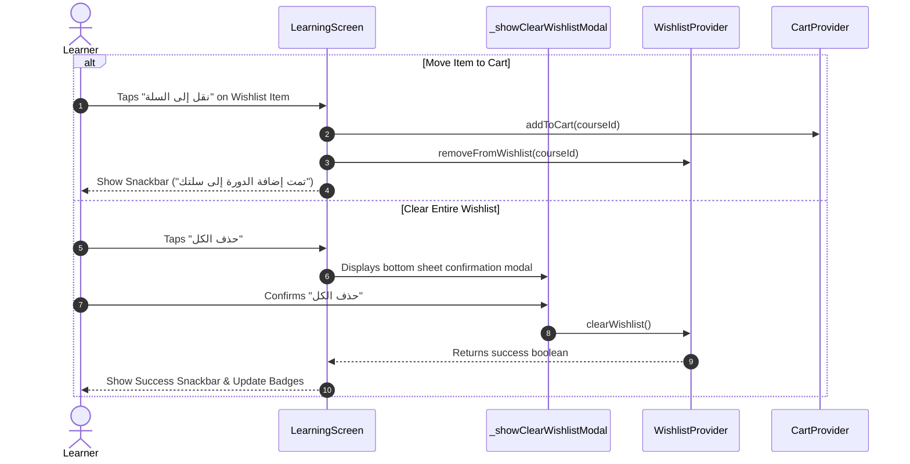

# Mobile Screen Deep-Dive: `LearningScreen`

> **File Path:** [`apps/mobile/lib/features/learning/presentation/screens/learning_screen.dart`](file:///d:/Programming/MonoRepo%20Porjects/EducationLab/apps/mobile/lib/features/learning/presentation/screens/learning_screen.dart)  
> **Route Name:** `'/learning'` (Main Tab 2 in `MainNavigationScreen`)  
> **Scale:** 2,481 lines of Dart code  
> **State Management:** `EnrollmentProvider`, `WishlistProvider`, `CartProvider`  
> **Repositories & Services:** `CertificatesRepository`, `ApiClient`  
> **Navigation Mode:** Operates both as an embedded root tab (`isTab: true`) and as a pushed route

---

## 1. Overview & Business Objective

`LearningScreen` is the central academic hub for enrolled students. It consolidates all learning activities, saved courses, and accredited achievements into an integrated three-portal experience:

1. **Enrolled Courses Portal (`LearningMainSection.myCourses`):** Displays active enrollments, resume-learning hero banner, real-time course progress tracking, and multi-criteria filter and sort controls.
2. **Wishlist & Favourites Portal (`LearningMainSection.myFavourite`):** Fast-access wishlist management allowing one-tap item migration into the active shopping cart and batch wishlist clearing.
3. **Accredited Certificates Portal (`LearningMainSection.myCertificates`):** Digital trophy case showcasing earned credentials, issuance timestamps, verification codes, and full-screen certificate rendering.

The screen features client-side reactive filtering, static certificate memory caching (`_cachedCertificates`), search query debouncing across titles/instructors/categories, and deep-link routing into [`LessonPlayerScreen`](file:///d:/Programming/MonoRepo%20Porjects/EducationLab/apps/mobile/lib/features/courses/presentation/screens/lesson_player_screen.dart).

---

## 2. Screen Architecture & State Machine



### 2.1 State Variables Registry

| Variable Name | Type | Lines | Initial Value | Scope & Lifecycle Purpose |
| :--- | :--- | :--- | :--- | :--- |
| `_currentSection` | `LearningMainSection` | [:42](file:///d:/Programming/MonoRepo%20Porjects/EducationLab/apps/mobile/lib/features/learning/presentation/screens/learning_screen.dart#L42) | `myCourses` | Active section tab. Modified via segment pill taps or initialized via `widget.initialTab`. |
| `_isSearching` | `bool` | [:45](file:///d:/Programming/MonoRepo%20Porjects/EducationLab/apps/mobile/lib/features/learning/presentation/screens/learning_screen.dart#L45) | `false` | Controls dynamic AppBar state (toggles between screen title and search `TextField`). |
| `_searchQuery` | `String` | [:46](file:///d:/Programming/MonoRepo%20Porjects/EducationLab/apps/mobile/lib/features/learning/presentation/screens/learning_screen.dart#L46) | `''` | Current query string applied synchronously across all 3 portals. |
| `_searchController` | `TextEditingController` | [:47](file:///d:/Programming/MonoRepo%20Porjects/EducationLab/apps/mobile/lib/features/learning/presentation/screens/learning_screen.dart#L47) | Empty | Controls the search text box; disposed in `dispose()`. |
| `_searchFocusNode` | `FocusNode` | [:48](file:///d:/Programming/MonoRepo%20Porjects/EducationLab/apps/mobile/lib/features/learning/presentation/screens/learning_screen.dart#L48) | `FocusNode()` | Manages virtual keyboard focus when entering/exiting search mode. |
| `_statusFilter` | `CourseStatusFilter` | [:51](file:///d:/Programming/MonoRepo%20Porjects/EducationLab/apps/mobile/lib/features/learning/presentation/screens/learning_screen.dart#L51) | `CourseStatusFilter.all` | Narrows courses by progress state (`all`, `inProgress`, `completed`, `notStarted`). |
| `_sortOption` | `CourseSortOption` | [:52](file:///d:/Programming/MonoRepo%20Porjects/EducationLab/apps/mobile/lib/features/learning/presentation/screens/learning_screen.dart#L52) | `recentAccess` | Sets sort comparator (`recentAccess`, `recentEnrolled`, `titleAZ`, `progressHigh`). |
| `_cachedCertificates` | `static List<CertificateModel>?` | [:55](file:///d:/Programming/MonoRepo%20Porjects/EducationLab/apps/mobile/lib/features/learning/presentation/screens/learning_screen.dart#L55) | `null` | Memory cache persisting certificate records across screen rebuilds and tab switching. |
| `_certRepo` | `CertificatesRepository` | [:56](file:///d:/Programming/MonoRepo%20Porjects/EducationLab/apps/mobile/lib/features/learning/presentation/screens/learning_screen.dart#L56) | `CertificatesRepository()` | API communication service querying `/api/Certificates/my-certificates`. |
| `_isLoadingCerts` | `bool` | [:57](file:///d:/Programming/MonoRepo%20Porjects/EducationLab/apps/mobile/lib/features/learning/presentation/screens/learning_screen.dart#L57) | `false` | Loading spinner flag displayed during certificate network fetches. |
| `_certificates` | `List<CertificateModel>` | [:58](file:///d:/Programming/MonoRepo%20Porjects/EducationLab/apps/mobile/lib/features/learning/presentation/screens/learning_screen.dart#L58) | `_cachedCertificates ?? []` | Local state holding active user certificates. |

---

## 3. UI Component Hierarchy & Layout Tree

The widget tree is structured to provide smooth switching between portals while maintaining sticky top navigation:

```
Scaffold (backgroundColor: dynamic dark/light)
├── AppBar
│   ├── Leading: Conditional back button (shown only if canPop and not main tab)
│   ├── Title: Dynamic Animated Cross-Fade:
│   │   ├── State A (Normal): Section Title ("تعلمي" / "My Learning")
│   │   └── State B (Searching): Cupertino-styled Search Container with Clear Button
│   └── Actions:
│       ├── Search Toggle IconButton (Opens/Closes search input)
│       ├── Filter/Sort Modal Trigger Button (Visible only on 'myCourses' tab)
│       └── Cart Icon with Animated Badge Counter
└── Body: NestedScrollView / CustomScrollView with RefreshIndicator
    ├── Top Section: Custom 3-Way Segmented Tab Bar
    │   ├── Tab 0: "دوراتي" (My Courses) + Enrolled Count Badge
    │   ├── Tab 1: "المفضلة" (Wishlist) + Saved Count Badge
    │   └── Tab 2: "شهاداتي" (Certificates) + Earned Count Badge
    └── Content View: AnimatedSwitcher (Portal Cross-Fade)
        ├── PORTAL 1: My Courses View
        │   ├── Hero Continue Learning Banner (if inProgressCourses.isNotEmpty)
        │   │   ├── Course Cover Thumbnail with Gradient Scrim
        │   │   ├── Title & Last Accessed Lesson Name
        │   │   ├── Linear Progress Bar & Percentage Tag
        │   │   └── "متابعة الدرس" Floating Play Button -> opens LessonPlayer
        │   ├── Active Filter Bar:
        │   │   ├── Status Filter Chips (All, In Progress, Completed, Not Started)
        │   │   └── Active Filter Reset Action (if filter != default)
        │   ├── Shimmer Loading List (if EnrollmentProvider.isLoading)
        │   ├── Enrolled Courses List (ListView.builder):
        │   │   └── Course Card:
        │   │       ├── Network Image Thumbnail with Cache Manager
        │   │       ├── Category Pill & Rating Badge
        │   │       ├── Course Title & Instructor Name
        │   │       ├── Progress Bar (0% - 100%) with Duration Text
        │   │       └── Action: "متابعة التعلم" or "إعادة المشاهدة"
        │   └── Empty State View (Empty illustration + "استكشف الدورات" CTA)
        ├── PORTAL 2: Wishlist View
        │   ├── Wishlist Header: Total Count & "حذف الكل" (Clear All) Button
        │   ├── Wishlist Items List:
        │   │   └── Wishlist Item Card:
        │   │       ├── Thumbnail & Price Tag (Original vs Discounted)
        │   │       ├── "إضافة إلى السلة" (Move to Cart) Primary Button
        │   │       └── Remove from Wishlist Trash Button
        │   └── Empty Wishlist State View
        └── PORTAL 3: Certificates View
            ├── Golden Trophy & Honors Showcase Header
            ├── Certificates Grid / List:
            │   └── Certificate Card:
            │       ├── Diploma Frame Vector & Golden Seal Icon
            │       ├── Course Title & Accredited Platform Signature
            │       ├── Completion Date & Unique Verification Code
            │       └── "عرض الشهادة" Button -> opens CertificateViewScreen
            └── Empty Certificate State View ("أكمل دورتك الأولى للحصول على شهادة")
```

---

## 4. Workflows & Runtime Behavior

### 4.1 Filter, Sort & Search Pipeline (`_processCourses`)

Whenever the user updates search text, selects a status chip, or alters the sort order, `_processCourses()` executes a 3-stage transformation pipeline:



### 4.2 Wishlist Transfer & Batch Clear Workflow



---

## 5. Method Catalog & Action Handlers

| Method Name | Signature | Lines | Description & Mutations |
| :--- | :--- | :--- | :--- |
| `_fetchCertificates` | `Future<void> _fetchCertificates({bool forceRefresh = false})` | [:86-105](file:///d:/Programming/MonoRepo%20Porjects/EducationLab/apps/mobile/lib/features/learning/presentation/screens/learning_screen.dart#L86-L105) | Checks `_cachedCertificates`; if empty or forced, sets `_isLoadingCerts = true`, queries `CertificatesRepository.getMyCertificates()`, updates static cache and local state. |
| `_showClearWishlistModal` | `Future<void> _showClearWishlistModal(int count)` | [:107-283](file:///d:/Programming/MonoRepo%20Porjects/EducationLab/apps/mobile/lib/features/learning/presentation/screens/learning_screen.dart#L107-L283) | Displays a bottom sheet modal warning the user of irreversible wishlist clearing with red icon, haptic impact, and cancel/confirm buttons. |
| `_processCourses` | `List<EnrollmentModel> _processCourses(List<EnrollmentModel> allCourses)` | [:285-329](file:///d:/Programming/MonoRepo%20Porjects/EducationLab/apps/mobile/lib/features/learning/presentation/screens/learning_screen.dart#L285-L329) | Filters enrolled courses by search query and `CourseStatusFilter`, then sorts according to `CourseSortOption`. |
| `_processWishlist` | `List<WishlistItemModel> _processWishlist(List<WishlistItemModel> items)` | [:331-339](file:///d:/Programming/MonoRepo%20Porjects/EducationLab/apps/mobile/lib/features/learning/presentation/screens/learning_screen.dart#L331-L339) | Filters wishlist items matching `courseTitle` or `instructorName` with `_searchQuery`. |
| `_processCertificates` | `List<CertificateModel> _processCertificates(List<CertificateModel> certs)` | [:341-348](file:///d:/Programming/MonoRepo%20Porjects/EducationLab/apps/mobile/lib/features/learning/presentation/screens/learning_screen.dart#L341-L348) | Filters certificates matching `courseTitle` or `certificateCode` with `_searchQuery`. |
| `_showFilterModal` | `void _showFilterModal(BuildContext context, bool isDark, bool isAr)` | [:350-538](file:///d:/Programming/MonoRepo%20Porjects/EducationLab/apps/mobile/lib/features/learning/presentation/screens/learning_screen.dart#L350-L538) | Renders a bottom sheet with `ChoiceChip` widgets for sorting and status filtering, providing instant apply and reset controls. |
| `_buildModalChoiceChip` | `Widget _buildModalChoiceChip(...)` | [:540-566](file:///d:/Programming/MonoRepo%20Porjects/EducationLab/apps/mobile/lib/features/learning/presentation/screens/learning_screen.dart#L540-L566) | Creates customized chips adhering to the design system with active primary color states and Tajawal typography. |

---

## 6. Security, Validation & Edge Cases

1. **Unauthenticated Access Handling:**
   * When accessed as a guest, `LearningScreen` renders a friendly guest gateway with "تسجيل الدخول للوصول إلى مقرراتك" and a primary login CTA. It prevents unauthenticated network queries to `/api/Enrollments` or `/api/Certificates`.
2. **Static Certificate Cache Memory Hygiene:**
   * `_cachedCertificates` is stored in static memory to eliminate flickering on tab switching.
   * `_fetchCertificates(forceRefresh: true)` is automatically dispatched upon `PullToRefresh` or after receiving a certificate issuance push notification via `NotificationProvider`.
3. **Optimistic Progress Synchronization:**
   * When returning from [`LessonPlayerScreen`](file:///d:/Programming/MonoRepo%20Porjects/EducationLab/apps/mobile/lib/features/courses/presentation/screens/lesson_player_screen.dart), `EnrollmentProvider` automatically synchronizes local lecture completion states, immediately recalculating `progressPercentage` without requiring a full network reload.
4. **Empty State & Layout Fallbacks:**
   * Handled independently for each of the 3 portals with distinct empty state illustrations, contextual copy, and action buttons ensuring the student never encounters a blank screen.
