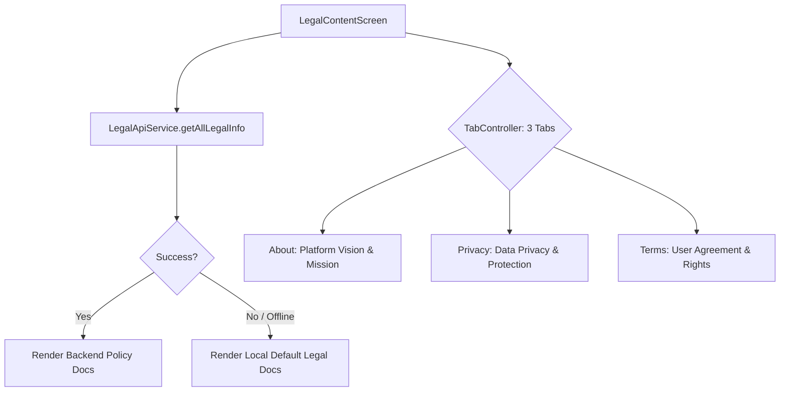

# Mobile Screen Deep-Dive: `LegalContentScreen`

> **File Path:** [`apps/mobile/lib/features/legal/presentation/screens/legal_content_screen.dart`](file:///d:/Programming/MonoRepo%20Porjects/EducationLab/apps/mobile/lib/features/legal/presentation/screens/legal_content_screen.dart)  
> **Route Name:** `'/legal-content'`  
> **Scale:** 568 lines of Dart code  
> **State Management:** `LegalApiService`  
> **Tabs:** `LegalTab.about`, `LegalTab.privacy`, `LegalTab.terms`

---

## 1. Overview & Business Objective

`LegalContentScreen` delivers institutional transparency, privacy compliance (GDPR/CCPA), and user agreements for the EducationLab platform.

Key capabilities:
1. **Three-Tab Legal Console:**
   * **عن المنصة (About):** Institutional mission, accreditation credentials, and leadership.
   * **سياسة الخصوصية (Privacy Policy):** Data collection disclosures, cookie handling, and student privacy rights.
   * **شروط الاستخدام (Terms of Service):** Course purchase terms, intellectual property, and community guidelines.
2. **Dynamic API Localization with Offline Fallbacks:** Fetches localized policies via `LegalApiService.getAllLegalInfo(language: locale)`. If network is unavailable, it gracefully renders pre-bundled offline documents via `LegalApiService.getDefaultDoc`.
3. **TabController Synchronization:** Smooth tab transitions with hardware back and localized RTL mirroring.

---

## 2. Screen Architecture & State Machine



### 2.1 State Variables Registry

| Variable Name | Type | Lines | Initial Value | Scope & Lifecycle Purpose |
| :--- | :--- | :--- | :--- | :--- |
| `widget.initialTab` | `LegalTab` | [:17](file:///d:/Programming/MonoRepo%20Porjects/EducationLab/apps/mobile/lib/features/legal/presentation/screens/legal_content_screen.dart#L17) | `LegalTab.about` | Sets which of the 3 tabs to open initially (e.g. Terms from Checkout). |
| `_tabController` | `TabController` | [:27](file:///d:/Programming/MonoRepo%20Porjects/EducationLab/apps/mobile/lib/features/legal/presentation/screens/legal_content_screen.dart#L27) | Length: 3 | Coordinates synchronized swipe and tab bar transitions with `SingleTickerProviderStateMixin`. |
| `_isLoading` | `bool` | [:29](file:///d:/Programming/MonoRepo%20Porjects/EducationLab/apps/mobile/lib/features/legal/presentation/screens/legal_content_screen.dart#L29) | `true` | Shimmer skeleton indicator during network fetch. |
| `_aboutDoc` | `LegalContentModel?` | [:30](file:///d:/Programming/MonoRepo%20Porjects/EducationLab/apps/mobile/lib/features/legal/presentation/screens/legal_content_screen.dart#L30) | `null` | Parsed markdown model for "About Us" section. |
| `_privacyDoc` | `LegalContentModel?` | [:31](file:///d:/Programming/MonoRepo%20Porjects/EducationLab/apps/mobile/lib/features/legal/presentation/screens/legal_content_screen.dart#L31) | `null` | Parsed markdown model for "Privacy Policy" section. |
| `_termsDoc` | `LegalContentModel?` | [:32](file:///d:/Programming/MonoRepo%20Porjects/EducationLab/apps/mobile/lib/features/legal/presentation/screens/legal_content_screen.dart#L32) | `null` | Parsed markdown model for "Terms of Service" section. |

---

## 3. UI Component Hierarchy & Layout Tree

```
Scaffold (backgroundColor: dynamic dark/light)
├── AppBar
│   ├── Leading: Localized back button
│   ├── Title: "الشروط والسياسات" / "Legal & Policies"
│   └── Bottom: TabBar (TabController: _tabController)
│       ├── Tab 0: "عن المنصة" (Info icon)
│       ├── Tab 1: "الخصوصية" (Shield icon)
│       └── Tab 2: "الشروط" (Document icon)
└── Body: TabBarView (controller: _tabController)
    ├── TabView 1: About Content (SingleChildScrollView)
    │   ├── Vision & Academic Mission Statement
    │   ├── Institutional Accreditations
    │   └── Platform Statistics & Governance
    ├── TabView 2: Privacy Policy Content (SingleChildScrollView)
    │   ├── Data Collection & Processing
    │   ├── Cookie Technologies & Tracking
    │   └── GDPR / CCPA Learner Rights
    └── TabView 3: Terms of Service Content (SingleChildScrollView)
        ├── Account Obligations & Security
        ├── Course Purchase, Access & Refund Rules (30 Days)
        └── Intellectual Property & Copyright Protection
```

---

## 4. Method Catalog & Action Handlers

| Method Name | Signature | Lines | Description & Mutations |
| :--- | :--- | :--- | :--- |
| `_loadData` | `Future<void> _loadData() async` | [:53-87](file:///d:/Programming/MonoRepo%20Porjects/EducationLab/apps/mobile/lib/features/legal/presentation/screens/legal_content_screen.dart#L53-L87) | Dispatches `LegalApiService.getAllLegalInfo(language: locale)`. Updates `_aboutDoc`, `_privacyDoc`, and `_termsDoc`. If API fails, seamlessly falls back to bundled `getDefaultDoc`. |

---

## 5. Security & Offline Resilience

1. **Zero-Failure Legal Guarantee:**
   * Regardless of server connectivity, legal agreements remain accessible through bundled static definitions, ensuring compliance with mobile app store submission rules (Apple App Store & Google Play guidelines).
2. **Context-Aware Directionality:**
   * Tab bars and article bodies dynamically mirror text alignment based on `Directionality.of(context) == TextDirection.rtl`.
