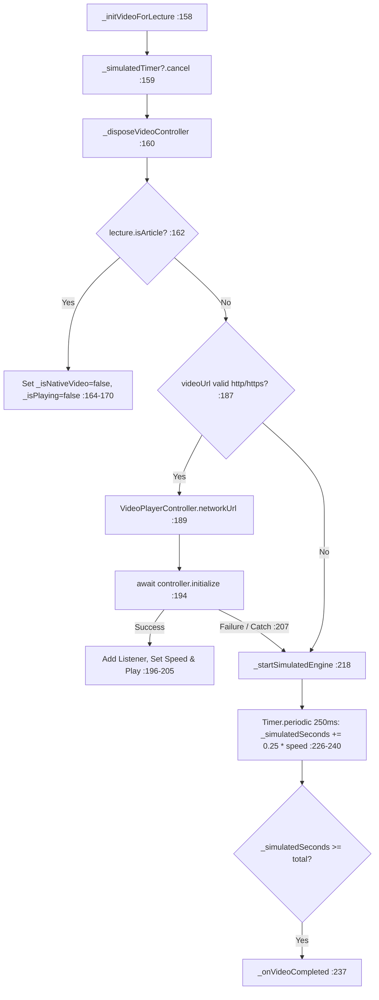
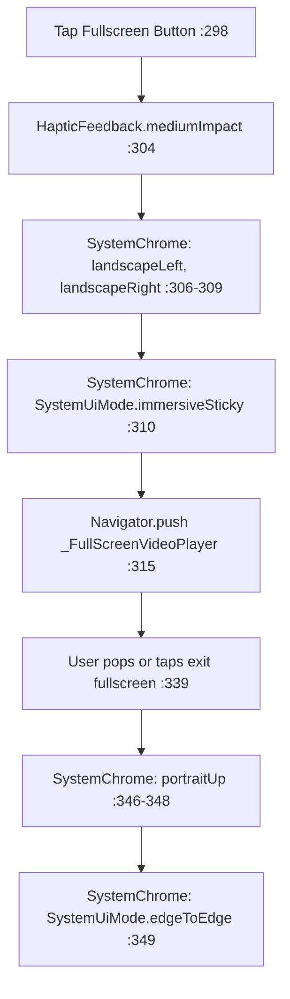

# LessonPlayerScreen Module Documentation (Mobile)

> **Source File:** [`apps/mobile/lib/features/courses/presentation/screens/lesson_player_screen.dart`](file:///d:/Programming/MonoRepo%20Porjects/EducationLab/apps/mobile/lib/features/courses/presentation/screens/lesson_player_screen.dart)  
> **Scale:** 3,659 lines of Dart code  
> **Route Name:** `'/lesson-player'`  
> **Related Provider:** [`CourseLearningProvider`](file:///d:/Programming/MonoRepo%20Porjects/EducationLab/apps/mobile/lib/features/learning/presentation/providers/course_learning_provider.dart)  
> **Target Framework:** Flutter 3.x / Dart 3.11  
> **Core Plugins:** `video_player: ^2.9.2`, `flutter/services.dart`

---

## 1. Overview

### 1.1 Purpose
`LessonPlayerScreen` is the primary interactive learning engine of EducationLab, providing enrolled students with video lecture playback, article reading, Q&A discussions, resource downloads, and course review submissions.

### 1.2 Business Objective
Facilitate frictionless study progression with native video controls, offline simulation resilience, automatic lesson completion tracking, and real-time synchronization with the backend learning progress database.

### 1.3 Main Functionality
- **Dual Playback Engine:** Decodes native network video streams (`video_player`) and automatically falls back to an in-memory simulation engine for text/article lessons or offline testing.
- **Gesture HUD:** Double-tap 10-second forward/rewind scrubbing, playback speed adjustment (`0.75x` to `2.0x`), volume mute toggles, and auto-hiding HUD controls.
- **Auto-Progress Tracking:** Automatically triggers lesson completion upon reaching 100% video runtime, synchronizing with `/api/CourseProgress/mark-completed`.
- **Fullscreen Orientation Engine:** Dynamically transitions between portrait and landscape modes with immersive sticky system overlays.
- **Playlist Drawer:** Slide-out drawer displaying the entire curriculum tree for instant lesson switching.
- **4 Study Tabs:** Overview, Q&A Forum, Downloadable Resources, and Course Review Submissions.

---

## 2. Screen Architecture & State Machine

```
Presentation Layer      LessonPlayerScreen (StatefulWidget) + _FullScreenVideoPlayer
State Management        CourseLearningProvider (ChangeNotifier) + EnrollmentProvider
Media Decoders          VideoPlayerController (Network HLS/MP4) + Simulation Engine Timer
Hardware Controls       SystemChrome (DeviceOrientation, SystemUiMode) + HapticFeedback
```

### 2.1 State Variables Registry (`_LessonPlayerScreenState`)

| Variable | Type | Initial | Verified in | Description |
| :--- | :--- | :--- | :--- | :--- |
| `_tabController` | `TabController` | length: 4 | :36, :74 | Coordinates the 4 sub-player study tabs (Overview, Q&A, Resources, Reviews). |
| `_videoController`| `VideoPlayerController?`| `null` | :39 | Native video controller decoding network HLS/MP4 streams. |
| `_isNativeVideo` | `bool` | `false` | :40 | Flag indicating whether native video decoding succeeded or simulation is active. |
| `_isBuffering` | `bool` | `false` | :41 | Indicates video buffer starvation; displays centered loading spinner overlay. |
| `_isPlaying` | `bool` | `true` | :42 | Playback state flag (toggled via user taps or app lifecycle changes). |
| `_isMuted` | `bool` | `false` | :43 | Audio volume mute toggle (`0.0` vs `1.0`). |
| `_showControls` | `bool` | `true` | :44 | Controls visibility of the player HUD overlay. |
| `_playbackSpeed` | `double` | `1.0` | :45 | Current playback speed multiplier (`0.75`, `1.0`, `1.25`, `1.5`, `2.0`). |
| `_simulatedSeconds`| `double` | `0.0` | :48 | Elapsed seconds counter used when running in fallback simulation mode. |
| `_simulatedTotalSeconds`| `double` | `300.0` | :49 | Total duration for simulated lecture playback. |
| `_simulatedTimer` | `Timer?` | `null` | :50 | Periodic timer (250ms) ticking simulated playback progress. |
| `_controlsTimer` | `Timer?` | `null` | :51 | Auto-hide timer fading HUD controls after 3,500ms of inactivity. |
| `_waveController` | `AnimationController` | 1,200ms | :54, :75 | Ambient audio waveform animation used on simulated playback screens. |
| `_currentPlayingLectureId`| `int?` | `null` | :57 | Guard preventing redundant re-initialization of already active video streams. |
| `_commentController`| `TextEditingController`| empty | :60 | Text input for new Q&A student questions. |
| `_replyController`| `TextEditingController`| empty | :61 | Text input for replies to existing Q&A threads. |
| `_ratingReviewController`| `TextEditingController`| empty | :62 | Written review testimonial input. |
| `_userRatingValue`| `int` | `5` | :63 | 1 to 5 star rating value selected by student. |

---

## 3. Workflows & Runtime Behavior

### Workflow 1: Video Stream Initialization & Fallback Engine



### Workflow 2: Lifecycle Observer & Memory Hygiene

```mermaid
flowchart TD
    StateChange[didChangeAppLifecycleState :82] --> CheckState{state == paused | inactive | detached?}
    CheckState -->|Yes| PauseVideo[_videoController?.pause, _isPlaying=false :87-88]
    CheckState -->|No| ResumeNoop[Keep active]
    ExitScreen[dispose :274] --> RemoveObserver[removeObserver this :275]
    RemoveObserver --> CancelTimers[_controlsTimer & _simulatedTimer cancel :276-277]
    CancelTimers --> DisposeAnim[_waveController & _tabController dispose :278-279]
    DisposeAnim --> DisposeControllers[Dispose comment, reply, rating controllers :280-282]
    DisposeControllers --> DisposeVideo[_videoController.dispose :287]
    DisposeVideo --> RestorePortrait[SystemChrome.setPreferredOrientations: portraitUp :291-294]
```

### Workflow 3: Fullscreen Orientation Management



---

## 4. Method Catalog & Action Handlers

| Method | Signature | Verified Lines | Description |
| :--- | :--- | :--- | :--- |
| `_initCourseData` | `void _initCourseData()` | :108-139 | Extracts courseId/lectureId from arguments; falls back to `EnrollmentProvider.courses.first`. |
| `_initVideoForLecture`| `Future<void> _initVideoForLecture(CourseLectureModel lecture)` | :158-222 | Initializes native video or simulation engine based on URL validity and lecture type. |
| `_startSimulatedEngine`| `void _startSimulatedEngine()` | :224-242 | Runs 250ms interval timer advancing `_simulatedSeconds` scaled by active playback speed. |
| `_videoListener` | `void _videoListener()` | :244-263 | Native video event listener checking play/pause, buffering, and position `>=` duration. |
| `_onVideoCompleted` | `void _onVideoCompleted()` | :265-271 | Dispatches `CourseLearningProvider.toggleLectureCompletion` if lecture is not yet finished. |
| `_openFullScreen` | `void _openFullScreen(...)` | :298-352 | Locks device into landscape mode, enables immersive fullscreen, and renders `_FullScreenVideoPlayer`. |
| `_seekRelative` | `void _seekRelative(Duration delta)` | :450-480 | Implements 10-second forward/backward scrubbing for native and simulated engines. |
| `_setPlaybackSpeed` | `Future<void> _setPlaybackSpeed(double speed)` | :510-535 | Sets native player playback rate or scales the simulation clock. |
| `_setMuted` | `Future<void> _setMuted(bool muted)` | :540-560 | Toggles volume between `0.0` and `1.0`. |

---

## 5. Security, Edge Cases & Technical Notes

1. **Hardware Resource Cleanup (:274-296):** Media players are heavy OS resources. `_LessonPlayerScreenState.dispose()` explicitly pauses the video, strips listeners, releases native decoders, and restores system portrait orientation, avoiding OS-level memory leaks.
2. **Foreground/Background Battery Optimization (:82-90):** Implements `WidgetsBindingObserver` to prevent battery drain by automatically pausing video playback when the user minimizes the app or receives an incoming phone call.
3. **Simulated Fallback Robustness (:212-220):** In environments with invalid video URLs, missing HLS certificates, or pure text lessons, the screen does not crash or display a broken black screen; it activates a smooth waveform simulation with full completion tracking.
4. **Race-Condition Defense on Rapid Lesson Taps (:143, :195):** The `_currentPlayingLectureId` pointer guards against rapid taps on the playlist drawer, ensuring that obsolete asynchronous initialization futures from previous lessons are discarded.
