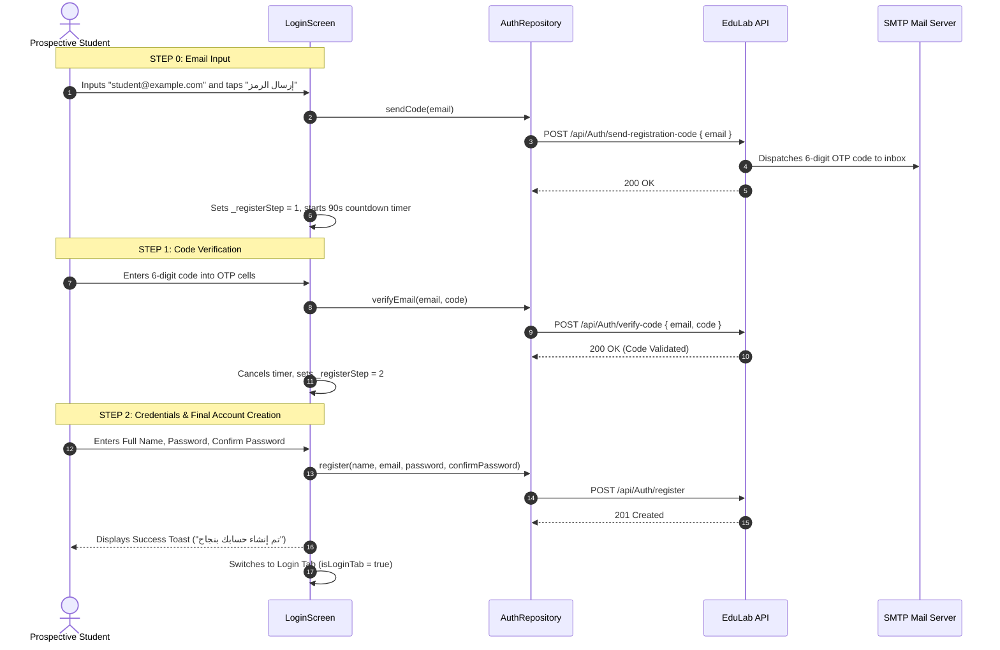

# Mobile Screen Deep-Dive: `LoginScreen`

> **File Path:** [`apps/mobile/lib/features/auth/presentation/screens/login_screen.dart`](file:///d:/Programming/MonoRepo%20Porjects/EducationLab/apps/mobile/lib/features/auth/presentation/screens/login_screen.dart)  
> **Route Name:** `'/login'`  
> **Scale:** 1,391 lines of Dart code  
> **State Management:** `AuthRepository`, `AuthStorageService`, `GoogleAuthService`, `AppSessionService`  
> **Animation Controllers:** 3,800ms ambient background looping controller with `SingleTickerProviderStateMixin`  
> **Authentication Vectors:** Email & Password, 3-Step Verified Email Registration with OTP, Google Mobile OAuth (Firebase-free native)

---

## 1. Overview & Business Objective

`LoginScreen` serves as the primary authentication and identity gateway of the EducationLab Flutter application. It balances frictionless access with rigorous anti-abuse verification:

1. **Dual-Mode Interactive Segment:** Seamless toggle between Login and Registration workflows with synchronized state retention.
2. **3-Step Email OTP Registration Pipeline:** Eliminates disposable and fake accounts by verifying email inbox ownership before requesting user passwords.
3. **90-Second Throttling Countdown:** Prevents SMTP exhaustion and brute-force flooding attacks through client-enforced cooldown timers.
4. **Native Google Mobile Sign-In:** Direct OAuth token acquisition via `GoogleAuthService`, exchanging the Google ID token with `/api/Auth/google-mobile` without requiring bloated Firebase dependencies.
5. **Guest Mode Fallback:** Allows learners to browse courses, reviews, and instructors without an account, seamlessly deferring authentication until cart checkout or lecture playback.
6. **Ambient Animated Canvas:** 3,800ms sine-curved background gradient loop providing a polished, high-production aesthetic.

---

## 2. Screen Architecture & State Machine

```mermaid
stateDiagram-v2
    [*] --> TabSelection: Screen Launched
    
    state TabSelection {
        LoginTab: Tab 0 - Login Mode
        RegisterTab: Tab 1 - Register Mode
    }
    
    LoginTab --> SubmitLogin: Enter Email & Password
    SubmitLogin --> Authenticated: POST /api/Auth/login -> 200 OK
    
    LoginTab --> GoogleOAuth: Tap Google Sign-In
    GoogleOAuth --> Authenticated: POST /api/Auth/google-mobile -> 200 OK
    
    LoginTab --> GuestSession: Tap "تخطي كزائر"
    GuestSession --> MainNav: AppSessionService.setGuestMode(true)

    RegisterTab --> Step0_Email: Step 0 (Enter Email)
    Step0_Email --> Step1_OTP: POST /api/Auth/send-code -> 90s Timer Started
    Step1_OTP --> Step0_Email: Tap "تعديل البريد"
    Step1_OTP --> Step2_Credentials: POST /api/Auth/verify-code (6 digits)
    Step2_Credentials --> LoginTab: POST /api/Auth/register -> Redirect to Login

    Authenticated --> MainNav: Store Tokens in AuthStorageService -> Route /main
    MainNav --> [*]
```



### 2.1 State Variables Registry

| Variable Name | Type | Lines | Initial Value | Scope & Lifecycle Purpose |
| :--- | :--- | :--- | :--- | :--- |
| `_bgController` | `AnimationController` | [:24](file:///d:/Programming/MonoRepo%20Porjects/EducationLab/apps/mobile/lib/features/auth/presentation/screens/login_screen.dart#L24) | 3,800ms | Animates ambient gradient shift on the scaffold background; loops indefinitely. |
| `_bgAnimation` | `Animation<double>` | [:25](file:///d:/Programming/MonoRepo%20Porjects/EducationLab/apps/mobile/lib/features/auth/presentation/screens/login_screen.dart#L25) | CurvedAnimation | Curvature easing (`Curves.easeInOutCubic`) mapped to background gradient opacity. |
| `isLoginTab` | `bool` | [:27](file:///d:/Programming/MonoRepo%20Porjects/EducationLab/apps/mobile/lib/features/auth/presentation/screens/login_screen.dart#L27) | `true` | Toggles between Login form (`true`) and Multi-step Register form (`false`). |
| `obscurePassword` | `bool` | [:28](file:///d:/Programming/MonoRepo%20Porjects/EducationLab/apps/mobile/lib/features/auth/presentation/screens/login_screen.dart#L28) | `true` | Visibility toggle for password text field. |
| `obscureConfirmPassword` | `bool` | [:29](file:///d:/Programming/MonoRepo%20Porjects/EducationLab/apps/mobile/lib/features/auth/presentation/screens/login_screen.dart#L29) | `true` | Visibility toggle for confirm password text field in Register Step 2. |
| `_isRegistering` | `bool` | [:30](file:///d:/Programming/MonoRepo%20Porjects/EducationLab/apps/mobile/lib/features/auth/presentation/screens/login_screen.dart#L30) | `false` | Loading flag during final registration submission. |
| `_isLoggingIn` | `bool` | [:31](file:///d:/Programming/MonoRepo%20Porjects/EducationLab/apps/mobile/lib/features/auth/presentation/screens/login_screen.dart#L31) | `false` | Loading flag during primary login request. |
| `_isSigningInWithGoogle` | `bool` | [:32](file:///d:/Programming/MonoRepo%20Porjects/EducationLab/apps/mobile/lib/features/auth/presentation/screens/login_screen.dart#L32) | `false` | Loading flag during Google OAuth token exchange. |
| `_isSendingCode` | `bool` | [:33](file:///d:/Programming/MonoRepo%20Porjects/EducationLab/apps/mobile/lib/features/auth/presentation/screens/login_screen.dart#L33) | `false` | Loading flag while dispatching registration OTP to inbox. |
| `_isVerifying` | `bool` | [:34](file:///d:/Programming/MonoRepo%20Porjects/EducationLab/apps/mobile/lib/features/auth/presentation/screens/login_screen.dart#L34) | `false` | Loading flag while validating 6-digit OTP cells against backend. |
| `_registerStep` | `int` | [:35](file:///d:/Programming/MonoRepo%20Porjects/EducationLab/apps/mobile/lib/features/auth/presentation/screens/login_screen.dart#L35) | `0` | Registration progress step (0: Email, 1: 6-Digit OTP, 2: Account Details). |
| `_resendSeconds` | `int` | [:36](file:///d:/Programming/MonoRepo%20Porjects/EducationLab/apps/mobile/lib/features/auth/presentation/screens/login_screen.dart#L36) | `90` | Remaining cooldown seconds before user can request a new OTP. |
| `_verifiedEmail` | `String?` | [:37](file:///d:/Programming/MonoRepo%20Porjects/EducationLab/apps/mobile/lib/features/auth/presentation/screens/login_screen.dart#L37) | `null` | Persists validated email between Step 0, Step 1, and Step 2. |
| `_resendTimer` | `Timer?` | [:38](file:///d:/Programming/MonoRepo%20Porjects/EducationLab/apps/mobile/lib/features/auth/presentation/screens/login_screen.dart#L38) | `null` | Periodic 1-second timer driving `_resendSeconds` countdown. |
| `_codeControllers` | `List<TextEditingController>` | [:47](file:///d:/Programming/MonoRepo%20Porjects/EducationLab/apps/mobile/lib/features/auth/presentation/screens/login_screen.dart#L47) | 6 items | Array of single-digit controllers for the OTP PIN entry widget. |
| `_codeFocusNodes` | `List<FocusNode>` | [:48](file:///d:/Programming/MonoRepo%20Porjects/EducationLab/apps/mobile/lib/features/auth/presentation/screens/login_screen.dart#L48) | 6 items | Array of focus nodes enabling automatic forward/backward focus hopping. |

---

## 3. UI Component Hierarchy & Layout Tree

```
Scaffold (backgroundColor: dynamic dark/light)
└── Stack
    ├── Ambient Animated Gradient Canvas (Transform / Opacity driven by _bgAnimation)
    └── SafeArea
        └── SingleChildScrollView (BouncingScrollPhysics)
            ├── Top Brand Header:
            │   ├── EduLab Animated Logo Badge (Gradient Container with Shadow)
            │   ├── App Title: "منصة إديولاب التعليمية"
            │   └── Subtitle: "بوابتك نحو التعلم الاحترافي والتميز الأكاديمي"
            ├── Segmented Tab Bar:
            │   ├── Tab 0: "تسجيل الدخول" (Active Indicator Pill)
            │   └── Tab 1: "إنشاء حساب" (Active Indicator Pill)
            └── Form Body: AnimatedSwitcher (300ms Cross-Fade)
                ├── VIEW 1: Login Form (isLoginTab == true)
                │   ├── Email TextFormField (Prefix icon, email keyboard)
                │   ├── Password TextFormField (Lock icon, obscure toggle eye)
                │   ├── Forgot Password Action Button -> opens ForgotPasswordModal
                │   ├── Submit Button: "دخول" (AppButton with _isLoggingIn spinner)
                │   ├── Or Divider: "أو المتابعة عبر"
                │   ├── Google Mobile Sign-In Button (FontAwesome Google icon)
                │   └── Guest Action: "التخطي والمتابعة كزائر"
                └── VIEW 2: Registration Multi-Step Form (isLoginTab == false)
                    ├── Stepper Step Indicator (3 Dots: البريد -> التحقق -> البيانات)
                    ├── Step 0: Email Entry View
                    │   ├── Email TextFormField
                    │   └── "إرسال رمز التحقق" Button (_isSendingCode spinner)
                    ├── Step 1: OTP Pin Verification View
                    │   ├── Explainer Note: "تم إرسال رمز مكون من 6 أرقام إلى:" + _verifiedEmail
                    │   ├── 6 Individual Square Digit Input Cells:
                    │   │   └── Digit Cell (Center text, bold 22px, auto-focus next node)
                    │   ├── Resend Cooldown Counter (e.g. "إعادة الإرسال بعد 01:24")
                    │   ├── "تأكيد الرمز" Button (_isVerifying spinner)
                    │   └── "تعديل البريد الإلكتروني" Back Button
                    └── Step 2: Personal Details View
                        ├── Full Name TextFormField (User icon, min 6 chars)
                        ├── Password TextFormField + Complexity Checklist:
                        │   ├── Min 8 characters indicator
                        │   ├── At least 1 uppercase letter indicator
                        │   └── At least 1 number indicator
                        ├── Confirm Password TextFormField
                        └── "إتمام التسجيل" Primary Button (_isRegistering spinner)
```

---

## 4. Workflows & Runtime Behavior

### 4.1 Three-Step Registration & OTP Verification Sequence



### 4.2 OTP Pin Cells Auto-Advance Logic (`_onCodeChanged`)

```mermaid
flowchart LR
    Cell0[Cell 0] -->|Digit entered| Focus1[Focus Node 1]
    Focus1 --> Cell1[Cell 1]
    Cell1 -->|Digit entered| Focus2[Focus Node 2]
    Focus2 --> Cell2[Cell 2]
    Cell2 -->|Digit entered| Focus3[Focus Node 3]
    Focus3 --> Cell3[Cell 3]
    Cell3 -->|Digit entered| Focus4[Focus Node 4]
    Focus4 --> Cell4[Cell 4]
    Cell4 -->|Digit entered| Focus5[Focus Node 5]
    Focus5 --> Cell5[Cell 5]
    Cell5 -->|All 6 filled| AutoSubmit[Auto-call _verifyCode]
    Cell3 -->|Backspace on empty| Focus2
```



---

## 5. Method Catalog & Action Handlers

| Method Name | Signature | Lines | Description & Mutations |
| :--- | :--- | :--- | :--- |
| `_switchTab` | `void _switchTab(int index)` | [:87-91](file:///d:/Programming/MonoRepo%20Porjects/EducationLab/apps/mobile/lib/features/auth/presentation/screens/login_screen.dart#L87-L91) | Switches active tab index between Login (0) and Register (1), triggering UI rebuild. |
| `_validateFullName` | `String? _validateFullName(String? value)` | [:93-101](file:///d:/Programming/MonoRepo%20Porjects/EducationLab/apps/mobile/lib/features/auth/presentation/screens/login_screen.dart#L93-L101) | Enforces non-empty full name with minimum length of 6 characters. |
| `_validatePassword` | `String? _validatePassword(String? value)` | [:103-115](file:///d:/Programming/MonoRepo%20Porjects/EducationLab/apps/mobile/lib/features/auth/presentation/screens/login_screen.dart#L103-L115) | Validates candidate password: min 8 chars, at least 1 uppercase (`[A-Z]`), and at least 1 digit (`[0-9]`). |
| `_submitLogin` | `Future<void> _submitLogin() async` | [:144-163](file:///d:/Programming/MonoRepo%20Porjects/EducationLab/apps/mobile/lib/features/auth/presentation/screens/login_screen.dart#L144-L163) | Validates form, dispatches login request via `AuthRepository.login()`, saves session tokens, and navigates to `'/main'`. |
| `_handleGoogleSignIn` | `Future<void> _handleGoogleSignIn() async` | [:165-192](file:///d:/Programming/MonoRepo%20Porjects/EducationLab/apps/mobile/lib/features/auth/presentation/screens/login_screen.dart#L165-L192) | Obtains native Google ID token from `GoogleAuthService.signInWithGoogle()`, submits token to backend `/api/Auth/google-mobile`, and routes to `'/main'`. |
| `_sendCode` | `Future<void> _sendCode() async` | [:218-242](file:///d:/Programming/MonoRepo%20Porjects/EducationLab/apps/mobile/lib/features/auth/presentation/screens/login_screen.dart#L218-L242) | Validates email address regex, dispatches code via `AuthRepository.sendCode()`, sets `_registerStep = 1`, and initiates 90s timer. |
| `_verifyCode` | `Future<void> _verifyCode() async` | [:244-271](file:///d:/Programming/MonoRepo%20Porjects/EducationLab/apps/mobile/lib/features/auth/presentation/screens/login_screen.dart#L244-L271) | Reads concatenated 6-cell digits, verifies code against backend API, cancels timer, and advances to `_registerStep = 2`. |
| `_startCountdown` | `void _startCountdown()` | [:273-284](file:///d:/Programming/MonoRepo%20Porjects/EducationLab/apps/mobile/lib/features/auth/presentation/screens/login_screen.dart#L273-L284) | Cancels prior timer, resets `_resendSeconds = 90`, and creates a 1-second periodic timer that decrements until zero. |
| `_onCodeChanged` | `void _onCodeChanged(int index, String value)` | [:298-304](file:///d:/Programming/MonoRepo%20Porjects/EducationLab/apps/mobile/lib/features/auth/presentation/screens/login_screen.dart#L298-L304) | Focus node coordinator: advances focus to `_codeFocusNodes[index + 1]` upon character entry, or retreats to `index - 1` on backspace. |

---

## 6. Security, Validation & Edge Cases

1. **Email Flooding & Brute-Force Defense:**
   * Enforces a non-bypassable 90-second resend cooldown timer on the client.
   * OTP boxes accept only numeric input (`FilteringTextInputFormatter.digitsOnly`), rejecting invalid characters.
2. **Controller & Timer Deallocation Hygiene:**
   * `_resendTimer?.cancel()` is invoked immediately in `dispose()` to prevent asynchronous callbacks on unmounted widgets.
   * All 6 `TextEditingController` instances and 6 `FocusNode` instances are iteratively disposed of, completely preventing memory leaks.
3. **Guest Session Mode Integration:**
   * Tapping "المتابعة كزائر" calls `AppSessionService.setGuestMode(true)`. The user is navigated to `MainNavigationScreen` (`'/main'`) with read-only exploration access. When a protected action is tapped later (e.g. buying a course), the user is redirected back to `LoginScreen` with a return route payload.
