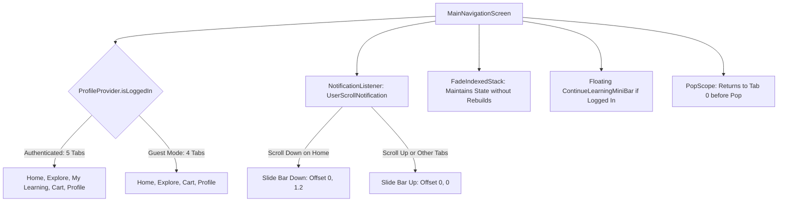

# Mobile Screen Deep-Dive: `MainNavigationScreen`

> **File Path:** [`apps/mobile/lib/features/main/presentation/screens/main_navigation_screen.dart`](file:///d:/Programming/MonoRepo%20Porjects/EducationLab/apps/mobile/lib/features/main/presentation/screens/main_navigation_screen.dart)  
> **Route Name:** `'/main'`  
> **Scale:** 487 lines of Dart code  
> **State Management:** `ProfileProvider`, `CartProvider`, `ExploreProvider`  
> **Core Components:** `FadeIndexedStack`, `ContinueLearningMiniBar`, `NotificationListener<UserScrollNotification>`, `PopScope`

---

## 1. Overview & Business Objective

`MainNavigationScreen` serves as the primary master shell and navigation backbone of the EducationLab mobile app. It anchors the core user journey by maintaining persistent state across 4 or 5 primary tabs, managing intelligent scroll-driven bottom bar transitions, and coordinating cross-feature deep linking.

Key architectural capabilities:
1. **Adaptive 4/5 Tab Configuration:** Dynamically adjusts the navigation hierarchy based on authentication status:
   * **Authenticated Learner (5 Tabs):** Home (0) $\to$ Explore (1) $\to$ My Learning (2) $\to$ Cart (3) $\to$ Profile (4).
   * **Guest User (4 Tabs):** Home (0) $\to$ Explore (1) $\to$ Cart (2) $\to$ Profile (3) (omits "My Learning").
2. **Smooth FadeIndexedStack Transitions:** Implements a custom `FadeIndexedStack` widget that preserves scroll offsets and state trees across all tabs while cross-fading active screens seamlessly.
3. **Scroll-Driven Auto-Hide Navigation:** Implements a `NotificationListener<UserScrollNotification>` that automatically hides the navigation bar when the user scrolls downward through the home feed (`HomeScreen`), and reveals it when scrolling up.
4. **Persistent Floating "Continue Learning" Mini-Bar:** Renders a floating Udemy-style resume bar (`ContinueLearningMiniBar`) directly above the bottom bar whenever the learner has active courses in progress.
5. **Re-Tap Active Tab Reset:** Tapping an already selected tab icon executes contextual reset actions (e.g., tapping "Explore" while viewing search results resets back to the main discovery catalog).
6. **Hardware Back Interception:** Pressing the device back button from tabs 1, 2, 3, or 4 gracefully routes the learner back to Tab 0 (`HomeScreen`) before closing the app.

---

## 2. Screen Architecture & State Machine



### 2.1 State Variables Registry

| Variable Name | Type | Lines | Initial Value | Scope & Lifecycle Purpose |
| :--- | :--- | :--- | :--- | :--- |
| `_currentIndex` | `int` | [:53](file:///d:/Programming/MonoRepo%20Porjects/EducationLab/apps/mobile/lib/features/main/presentation/screens/main_navigation_screen.dart#L53) | `0` | Active selected tab index. Bound to `FadeIndexedStack`. |
| `_userName` | `String` | [:54](file:///d:/Programming/MonoRepo%20Porjects/EducationLab/apps/mobile/lib/features/main/presentation/screens/main_navigation_screen.dart#L54) | `''` | Cached learner name loaded from `AuthStorageService`. |
| `_isNavBarVisible` | `bool` | [:55](file:///d:/Programming/MonoRepo%20Porjects/EducationLab/apps/mobile/lib/features/main/presentation/screens/main_navigation_screen.dart#L55) | `true` | Visibility flag toggled during vertical scrolling on `HomeScreen`. |

---

## 3. UI Component Hierarchy & Layout Tree

```
Scaffold (extendBody: true, backgroundColor: dynamic dark/light)
└── PopScope (canPop: _currentIndex == 0, onPopInvoked: switchTab(0))
    └── NotificationListener<UserScrollNotification> (Scroll detection on Tab 0)
        └── Stack
            ├── FadeIndexedStack (Screen memory cache & cross-fade)
            │   ├── Screen 0: HomeScreen (isLoggedIn, userName)
            │   ├── Screen 1: ExploreScreen (isTab: true)
            │   ├── Screen 2: LearningScreen (isTab: true, conditional on auth)
            │   ├── Screen 3: CartScreen (isTab: true)
            │   └── Screen 4: ProfileScreen (isTab: true)
            └── Positioned (bottom: 0, left: 0, right: 0)
                └── AnimatedSlide (280ms cubic easeInOut)
                    └── AnimatedOpacity (220ms easeInOut)
                        └── Column (mainAxisSize: min)
                            ├── ContinueLearningMiniBar (Udemy style floating card)
                            └── Bottom Navigation Container (Surface styling & top border)
                                └── SafeArea (top: false)
                                    └── SizedBox (height: 56)
                                        └── Row: Expanded _NavBarButton for each tab
                                            ├── AnimatedScale Icon (Selected: 1.1x with active primary color)
                                            ├── Badge Counter (Over Cart icon)
                                            └── AnimatedDefaultTextStyle Label (Tajawal bold 11px)
```

---

## 4. Static Deep-Link Helper (`switchToExplore`)

`MainNavigationScreen` provides a public static routing interface allowing any child component in the widget tree to transition into a pre-filtered catalog view:

```dart
static void switchToExplore(
  BuildContext context, {
  CategoryItem? category,
  String? searchQuery,
  int? filterIndex,
  bool autoFocusSearch = false,
}) {
  Navigator.of(context).push(
    MaterialPageRoute(
      builder: (_) => ExploreScreen(
        isTab: false,
        initialCategory: category,
        initialSearchQuery: searchQuery,
        initialFilterIndex: filterIndex,
        autoFocusSearch: autoFocusSearch,
      ),
    ),
  );
}
```

---

## 5. Method Catalog & Action Handlers

| Method Name | Signature | Lines | Description & Mutations |
| :--- | :--- | :--- | :--- |
| `of` | `static MainNavigationScreenState? of(BuildContext context)` | [:22-24](file:///d:/Programming/MonoRepo%20Porjects/EducationLab/apps/mobile/lib/features/main/presentation/screens/main_navigation_screen.dart#L22-L24) | Inherited widget locator pattern exposing tab switching to deep subtree descendants. |
| `_loadAuthState` | `Future<void> _loadAuthState()` | [:63-70](file:///d:/Programming/MonoRepo%20Porjects/EducationLab/apps/mobile/lib/features/main/presentation/screens/main_navigation_screen.dart#L63-L70) | Reads login status and display name from `AuthStorageService`. |
| `_switchTab` | `void _switchTab(int index)` | [:74-93](file:///d:/Programming/MonoRepo%20Porjects/EducationLab/apps/mobile/lib/features/main/presentation/screens/main_navigation_screen.dart#L74-L93) | Handles tab switching: if tapping current Explore tab, resets search filters; otherwise provides haptic feedback, switches index, and ensures bottom bar visibility. |

---

## 6. Security & Edge Case Resilience

1. **Active Tab Boundary Defense:**
   * If an authenticated user logs out, the tab list shrinks from 5 items to 4. `MainNavigationScreen` checks `if (_currentIndex >= tabs.length) _currentIndex = 0;` to prevent index out of bounds exceptions.
2. **Scroll Direction Isolation:**
   * Auto-hiding of the navigation bar is restricted strictly to `_currentIndex == 0` (`HomeScreen`). On Explore, Learning, Cart, and Profile screens, the navbar remains fixed, ensuring consistent access to navigation controls.
