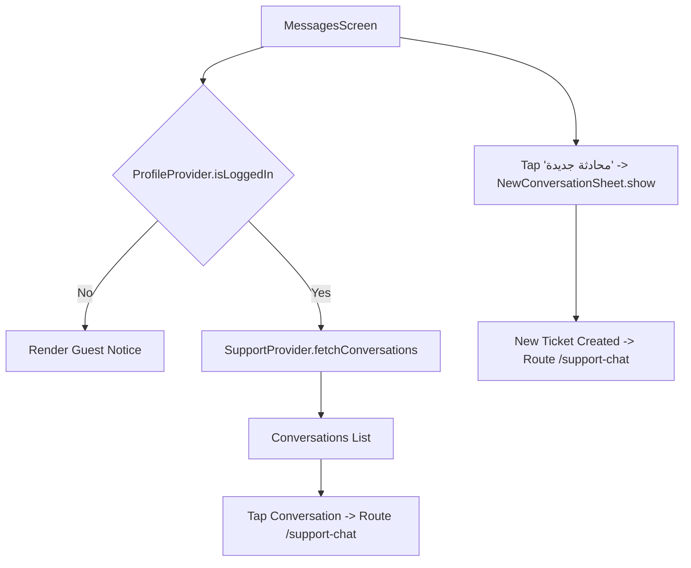

# Mobile Screen Deep-Dive: `MessagesScreen`

> **File Path:** [`apps/mobile/lib/features/inbox/presentation/screens/messages_screen.dart`](file:///d:/Programming/MonoRepo%20Porjects/EducationLab/apps/mobile/lib/features/inbox/presentation/screens/messages_screen.dart)  
> **Route Name:** `'/messages'`  
> **Scale:** 596 lines of Dart code  
> **State Management:** `SupportProvider`, `ProfileProvider`  
> **Real-Time Integration:** Connected with `SupportHubService` & `/api/Support/conversations`

---

## 1. Overview & Business Objective

`MessagesScreen` is the user's personal helpdesk and academic communication inbox. It presents a centralized history of support tickets, academic inquiries, and active consultations.

Key features:
1. **Support Thread Indexing:** Displays all past and active tickets with status pills (Open vs Closed), agent assignment indicators, and unread badges.
2. **Interactive Ticket Creation:** Floating action button and header action triggering `NewConversationSheet.show(context)` to initiate new support tickets with subject, category, and initial inquiry.
3. **Relative Timestamp Formatting:** Specialized localized time formatting engine (`_formatRelativeTime`) displaying human-readable timestamps ("الآن", "منذ 15 د", "أمس", etc.).
4. **Instant Chat Navigation:** Tapping any conversation pushes directly into [`SupportChatScreen`](file:///d:/Programming/MonoRepo%20Porjects/EducationLab/Documentation/Modules/Mobile/Screens/SupportChatScreen.md).

---

## 2. Screen Architecture & State Machine



---

## 3. UI Component Hierarchy & Layout Tree

```
Scaffold (backgroundColor: dynamic dark/light)
├── AppBar
│   ├── Leading: Localized back button
│   ├── Title: "الرسائل والدعم" / "Messages"
│   └── Actions:
│       └── Refresh Button / New Conversation Action
├── FloatingActionButton
│   └── Extended FAB: Message Icon + "تذكرة جديدة" -> _openNewConversation()
└── Body: RefreshIndicator (Pull-to-Refresh: fetchConversations)
    └── AnimatedSwitcher
        ├── State A (Loading): Shimmer Skeleton Ticket List
        ├── State B (Empty): Empty Inbox Illustration + "لا توجد رسائل سابقة" + "ابدأ محادثة" CTA
        └── State C (Data): ListView.separated
            └── Conversation Card:
                ├── Circular Status Icon (Green Headset: Open / Gray Check: Closed)
                ├── Subject Title (Bold Tajawal 15px)
                ├── Last Message Snippet (Truncated with ellipsis)
                ├── Timestamp (Relative: e.g. "منذ 5 د")
                ├── Status Badge: "مفتوحة" (Emerald) vs "مغلقة" (Muted)
                └── Unread Counter Badge (if unreadCount > 0)
```

---

## 4. Method Catalog & Action Handlers

| Method Name | Signature | Lines | Description & Mutations |
| :--- | :--- | :--- | :--- |
| `_formatRelativeTime` | `String _formatRelativeTime(DateTime? dt, bool isArabic)` | [:31-48](file:///d:/Programming/MonoRepo%20Porjects/EducationLab/apps/mobile/lib/features/inbox/presentation/screens/messages_screen.dart#L31-L48) | Converts DateTime to localized relative string: "الآن" (<1m), "منذ X د" (<1h), formatted time (today), "أمس" (yesterday), or date (older). |
| `_openNewConversation` | `void _openNewConversation() async` | [:50-59](file:///d:/Programming/MonoRepo%20Porjects/EducationLab/apps/mobile/lib/features/inbox/presentation/screens/messages_screen.dart#L50-L59) | Opens modal sheet `NewConversationSheet.show(context)`. If a ticket is created, routes directly to `SupportChatScreen`. |

---

## 5. Security & Edge Case Resilience

1. **Unauthenticated Session Protection:**
   * Checks `ProfileProvider.isLoggedIn` before issuing network requests to `/api/Support/conversations`, preventing 401 unauthorized errors.
2. **Dynamic RTL Layout Direction:**
   * Back button adjusts based on `Directionality.of(context) == TextDirection.rtl` to guarantee proper orientation on Arabic and English devices.
