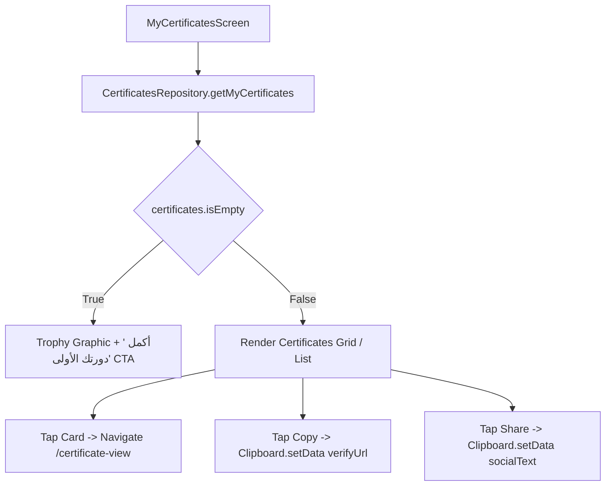

# Mobile Screen Deep-Dive: `MyCertificatesScreen`

> **File Path:** [`apps/mobile/lib/features/courses/presentation/screens/my_certificates_screen.dart`](file:///d:/Programming/MonoRepo%20Porjects/EducationLab/apps/mobile/lib/features/courses/presentation/screens/my_certificates_screen.dart)  
> **Route Name:** `'/my-certificates'`  
> **Scale:** 478 lines of Dart code  
> **State Management:** `CertificatesRepository`  
> **Features:** Honors Showcase Gallery, Direct Credential Verification Links, Social Sharing

---

## 1. Overview & Business Objective

`MyCertificatesScreen` is the student's digital honors trophy room. It aggregates all accredited graduation certificates earned across completed courses in an elegant, trophy-themed showcase.

Key capabilities:
1. **Accredited Portfolio Gallery:** Cards displaying diploma thumbnails, course titles, completion dates, and official credential IDs.
2. **Instant Verification Copying:** One-tap clipboard copy for the public verification link (`fullVerifyUrl`).
3. **LinkedIn & Social Sharing:** Pre-formats professional achievement copy for instant sharing on social platforms.
4. **Direct Fullscreen Viewer:** Tapping any certificate card pushes directly into [`CertificateViewScreen`](file:///d:/Programming/MonoRepo%20Porjects/EducationLab/Documentation/Modules/Mobile/Screens/CertificateViewScreen.md).

---

## 2. Screen Architecture & State Machine



---

## 3. UI Component Hierarchy & Layout Tree

```
Scaffold (backgroundColor: dynamic dark/light)
├── AppBar
│   ├── Leading: Localized back button
│   └── Title: "شهاداتي الأكاديمية" / "My Certificates"
└── Body: RefreshIndicator (Pull-to-Refresh: _loadCertificates)
    └── AnimatedSwitcher
        ├── State A (Loading): Skeleton Shimmer Cards Grid
        ├── State B (Empty): Honors Trophy Graphic + "لم تحصل على شهادات بعد" + "تصفح الدورات" CTA
        └── State C (Data): ListView.separated (padding: 16)
            └── Certificate Item Card:
                ├── Golden Seal Frame Vector
                ├── Course Title (Bold Tajawal 15px)
                ├── Student Full Name & Completion Date
                ├── Credential Code Badge (EL-...)
                └── Quick Actions Row:
                    ├── Action 1: "عرض الشهادة" -> _openCertificate()
                    ├── Action 2: Copy Link Icon Button -> _copyVerifyLink()
                    └── Action 3: Share Icon Button -> _shareCertificate()
```

---

## 4. Method Catalog & Action Handlers

| Method Name | Signature | Lines | Description & Mutations |
| :--- | :--- | :--- | :--- |
| `_loadCertificates` | `Future<void> _loadCertificates() async` | [:32-51](file:///d:/Programming/MonoRepo%20Porjects/EducationLab/apps/mobile/lib/features/courses/presentation/screens/my_certificates_screen.dart#L32-L51) | Queries `/api/Certificates/my-certificates`, updates `_certificates`, and handles errors. |
| `_openCertificate` | `void _openCertificate(CertificateModel cert)` | [:53-67](file:///d:/Programming/MonoRepo%20Porjects/EducationLab/apps/mobile/lib/features/courses/presentation/screens/my_certificates_screen.dart#L53-L67) | Navigates to `CertificateViewScreen` with pre-filled student and course metadata. |
| `_copyVerifyLink` | `void _copyVerifyLink(CertificateModel cert)` | [:69-73](file:///d:/Programming/MonoRepo%20Porjects/EducationLab/apps/mobile/lib/features/courses/presentation/screens/my_certificates_screen.dart#L69-L73) | Copies `cert.fullVerifyUrl` to clipboard with confirmation toast. |
| `_shareCertificate` | `void _shareCertificate(CertificateModel cert)` | [:75-84](file:///d:/Programming/MonoRepo%20Porjects/EducationLab/apps/mobile/lib/features/courses/presentation/screens/my_certificates_screen.dart#L75-L84) | Prepares formatted achievement text and copies to clipboard with success feedback. |
