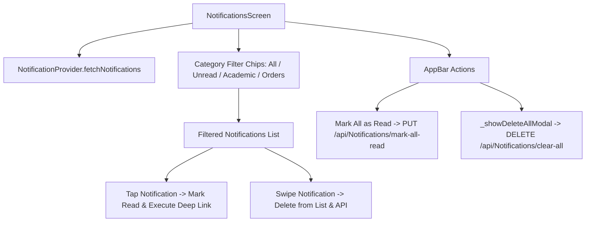

# Mobile Screen Deep-Dive: `NotificationsScreen`

> **File Path:** [`apps/mobile/lib/features/inbox/presentation/screens/notifications_screen.dart`](file:///d:/Programming/MonoRepo%20Porjects/EducationLab/apps/mobile/lib/features/inbox/presentation/screens/notifications_screen.dart)  
> **Route Name:** `'/notifications'`  
> **Scale:** 804 lines of Dart code  
> **State Management:** `NotificationProvider`  
> **Backend Integration:** Synchronized with `/api/Notifications` (fetching, marking read, clearing)

---

## 1. Overview & Business Objective

`NotificationsScreen` is the alert notification center for the EducationLab mobile app. It aggregates academic milestones, lecture updates, assignment deadlines, system alerts, and billing receipts.

Key capabilities:
1. **Interactive Categorization & Filtering:** Filter pills to isolate unread notifications, system announcements, or order confirmations.
2. **Contextual Deep Linking:** Tapping any notification inspects its metadata payload (`NotificationType` / `TargetUrl`) and routes directly to the relevant screen:
   * **Course Updates:** Navigates to [`LessonPlayerScreen`](file:///d:/Programming/MonoRepo%20Porjects/EducationLab/Documentation/Modules/Mobile/Screens/LessonPlayerScreen.md).
   * **Financial Invoices:** Navigates to [`PurchaseHistoryScreen`](file:///d:/Programming/MonoRepo%20Porjects/EducationLab/Documentation/Modules/Mobile/Screens/PurchaseHistoryScreen.md).
   * **Certificates:** Navigates to [`CertificateViewScreen`](file:///d:/Programming/MonoRepo%20Porjects/EducationLab/Documentation/Modules/Mobile/Screens/CertificateViewScreen.md).
3. **Destructive Mass Deletion with Protection:** Modal bottom sheet confirmation preventing accidental loss of notification history.
4. **Swipe-to-Dismiss:** Individual notification dismissal via swipe gestures with haptic feedback.
5. **Mark All as Read:** One-tap action synchronizing read receipts across both local state and backend database records.

---

## 2. Screen Architecture & State Machine



---

## 3. UI Component Hierarchy & Layout Tree

```
Scaffold (backgroundColor: dynamic dark/light)
├── AppBar
│   ├── Leading: Back button
│   ├── Title: "الإشعارات" / "Notifications"
│   └── Actions:
│       ├── Mark All As Read Button (Check-all icon)
│       └── Clear All Trash Button -> triggers _showDeleteAllModal()
└── Body: RefreshIndicator (Pull-to-Refresh: fetchNotifications)
    └── Column
        ├── Filter Chips Row (Horizontal Scroll):
        │   ├── "الكل" (All Notifications)
        │   ├── "غير مقروءة" (Unread Only Badge)
        │   ├── "الدورات والتعلم" (Academic Updates)
        │   └── "الطلبات والفواتير" (Financial Invoices)
        └── Expanded: AnimatedSwitcher
            ├── State A (Loading): AppSkeleton Shimmer List
            ├── State B (Empty): Notification Empty Illustration + "لا توجد إشعارات جديدة"
            └── State C (Data): ListView.builder
                └── Dismissible Notification Card:
                    ├── Background: Red trash container
                    └── Card Surface:
                        ├── Unread Indicator Dot (Emerald Green)
                        ├── Category Icon Container (Book, Trophy, Receipt, Bell)
                        ├── Title (Bold Tajawal) + Timestamp (Relative: "منذ ساعتين")
                        ├── Message Content Text
                        └── Trailing Chevron Icon
```

---

## 4. Method Catalog & Action Handlers

| Method Name | Signature | Lines | Description & Mutations |
| :--- | :--- | :--- | :--- |
| `_showDeleteAllModal` | `Future<void> _showDeleteAllModal(int count)` | [:27-120](file:///d:/Programming/MonoRepo%20Porjects/EducationLab/apps/mobile/lib/features/inbox/presentation/screens/notifications_screen.dart#L27-L120) | Opens red-themed confirmation bottom sheet. On confirm, calls `NotificationProvider.clearAllNotifications()`. |
| `_onNotificationTap` | `void _onNotificationTap(NotificationModel item)` | Custom | Marks notification as read and resolves target deep-link route based on notification metadata. |
| `_dismissItem` | `void _dismissItem(String id)` | Custom | Dispatches deletion to `NotificationProvider.deleteNotification(id)` with medium haptic impact. |

---

## 5. Security & Edge Case Resilience

1. **Optimistic Dismissal Rollback:**
   * If network communication fails during item dismissal, the deleted notification is re-inserted into the in-memory list and an error snackbar is displayed.
2. **Deep-Link Target Validation:**
   * Verifies route existence before pushing navigation to avoid application crashes on deprecated or malformed push notification payloads.
