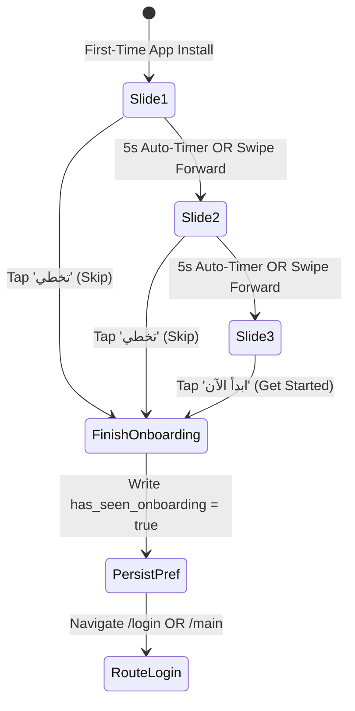

# Mobile Screen Deep-Dive: `OnboardingScreen`

> **File Path:** [`apps/mobile/lib/features/onboarding/presentation/screens/onboarding_screen.dart`](file:///d:/Programming/MonoRepo%20Porjects/EducationLab/apps/mobile/lib/features/onboarding/presentation/screens/onboarding_screen.dart)  
> **Route Name:** `'/'` (First-time user launch)  
> **Scale:** 464 lines of Dart code  
> **State Management:** `SharedPreferences` (`has_seen_onboarding`)  
> **Animation Architecture:** 3 Tickers (`_pageIntroController`, `_pulseController`, `_orbitController`)

---

## 1. Overview & Business Objective

`OnboardingScreen` is the first visual interaction for newly installed mobile users. It introduces EducationLab's core value propositions, features interactive page transitions, and persists onboarding completion state.

Key capabilities:
1. **Three Value Proposition Slides:**
   * **Slide 1:** "تعلم مهارات المستقبل" (Future Skills & Career Acceleration).
   * **Slide 2:** "نخبة من أفضل المحاضرين" (World-Class Verified Faculty).
   * **Slide 3:** "شهادات إتمام معتمدة" (Accredited Diplomas & Industry Recognition).
2. **Multi-Ticker Animated Illustrations:**
   * `_pulseController` (3,000ms): Glowing radial breathing effect behind core icons.
   * `_orbitController` (5,000ms): Orbiting geometric satellite badges simulating academic progression.
   * `_pageIntroController` (700ms): Slide entrance spring animation on page change.
3. **Timer-Driven Auto-Advance:** Automatically advances to the next slide every 5 seconds until reaching the final slide or user touch interaction.
4. **Permanent State Persistence:** Writes `has_seen_onboarding = true` to `SharedPreferences`, ensuring returning users launch directly into the main app.

---

## 2. Screen Architecture & State Machine



### 2.1 State Variables Registry

| Variable Name | Type | Lines | Initial Value | Scope & Lifecycle Purpose |
| :--- | :--- | :--- | :--- | :--- |
| `_pageController` | `PageController` | [:17](file:///d:/Programming/MonoRepo%20Porjects/EducationLab/apps/mobile/lib/features/onboarding/presentation/screens/onboarding_screen.dart#L17) | `PageController()` | Coordinates slide swipes and programmatic navigation. |
| `_currentPage` | `int` | [:18](file:///d:/Programming/MonoRepo%20Porjects/EducationLab/apps/mobile/lib/features/onboarding/presentation/screens/onboarding_screen.dart#L18) | `0` | Active slide index (0, 1, 2). |
| `_autoAdvanceTimer` | `Timer?` | [:19](file:///d:/Programming/MonoRepo%20Porjects/EducationLab/apps/mobile/lib/features/onboarding/presentation/screens/onboarding_screen.dart#L19) | `null` | Periodic 5-second timer advancing slides; cancelled on user touch or final slide. |
| `_pageIntroController` | `AnimationController` | [:21](file:///d:/Programming/MonoRepo%20Porjects/EducationLab/apps/mobile/lib/features/onboarding/presentation/screens/onboarding_screen.dart#L21) | 700ms | Orchestrates icon and text entrance effects on slide changes. |
| `_pulseController` | `AnimationController` | [:22](file:///d:/Programming/MonoRepo%20Porjects/EducationLab/apps/mobile/lib/features/onboarding/presentation/screens/onboarding_screen.dart#L22) | 3,000ms | Continuous pulsing breathing glow behind slide icons. |
| `_orbitController` | `AnimationController` | [:23](file:///d:/Programming/MonoRepo%20Porjects/EducationLab/apps/mobile/lib/features/onboarding/presentation/screens/onboarding_screen.dart#L23) | 5,000ms | Continuous 360-degree rotation of satellite orbiting particles. |

---

## 3. UI Component Hierarchy & Layout Tree

```
Scaffold (backgroundColor: surface)
├── SafeArea
│   └── Column
│       ├── Top Bar:
│       │   ├── App Logo & Title
│       │   └── TextButton: "تخطي" (Skip) -> _completeOnboarding()
│       ├── Expanded: PageView.builder (controller: _pageController)
│       │   └── Slide Item:
│       │       ├── Animated Graphic:
│       │       │   ├── Stack with Orbiting Badges (_orbitController)
│       │       │   ├── Glowing Halo (_pulseController)
│       │       │   └── Central Vector Icon (Rocket, Faculty, Trophy)
│       │       ├── Title (Bold 24px, Tajawal)
│       │       └── Subtitle Description (Muted Secondary)
│       └── Bottom Navigation Bar:
│           ├── Animated Page Indicators (3 Dots with active width expansion)
│           └── Action Button:
│               ├── Slides 0-1: Circular Next Arrow Button
│               └── Slide 2: Full-Width "ابدأ الآن" (Get Started) Button
```

---

## 4. Method Catalog & Action Handlers

| Method Name | Signature | Lines | Description & Mutations |
| :--- | :--- | :--- | :--- |
| `_startAutoAdvance` | `void _startAutoAdvance()` | [:67-78](file:///d:/Programming/MonoRepo%20Porjects/EducationLab/apps/mobile/lib/features/onboarding/presentation/screens/onboarding_screen.dart#L67-L78) | Initiates 5-second auto-slide transition if not on the final slide. |
| `_onPageChanged` | `void _onPageChanged(int index)` | [:88-92](file:///d:/Programming/MonoRepo%20Porjects/EducationLab/apps/mobile/lib/features/onboarding/presentation/screens/onboarding_screen.dart#L88-L92) | Updates `_currentPage`, resets intro animation, and restarts timer. |
| `_completeOnboarding` | `Future<void> _completeOnboarding() async` | [:94-97](file:///d:/Programming/MonoRepo%20Porjects/EducationLab/apps/mobile/lib/features/onboarding/presentation/screens/onboarding_screen.dart#L94-L97) | Sets `has_seen_onboarding = true` in `SharedPreferences`. |

---

## 5. Security & Edge Case Resilience

1. **Timer Leak Defense:**
   * Disposes `_autoAdvanceTimer` and all 3 `AnimationController` instances in `dispose()`, preventing background timer execution after exiting onboarding.
