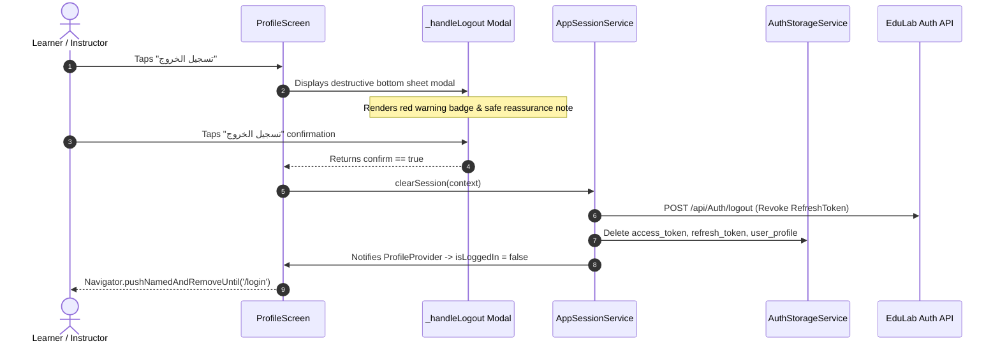

# Mobile Screen Deep-Dive: `ProfileScreen`

> **File Path:** [`apps/mobile/lib/features/profile/presentation/screens/profile_screen.dart`](file:///d:/Programming/MonoRepo%20Porjects/EducationLab/apps/mobile/lib/features/profile/presentation/screens/profile_screen.dart)  
> **Route Name:** `'/profile'` (Tab 3 in 4-tab mode or Tab 4 in 5-tab mode in `MainNavigationScreen`)  
> **Scale:** 591 lines of Dart code  
> **State Management:** `ProfileProvider`, `AppSessionService`  
> **Layout Structure:** Card-grouped iOS/Cupertino style menu clusters inside a pull-to-refresh `ListView`

---

## 1. Overview & Business Objective

`ProfileScreen` is the central account management, identity, and application preferences console of EducationLab. It bridges personal identity information with educational achievements, billing records, instructor applications, app preferences, and session termination.

Key capabilities:
1. **Dynamic Authentication State Handling:** Context-aware UI that adjusts between an authenticated student/instructor account and an unauthenticated guest user. Guests are greeted with a prominent login/register invitation banner while concealing personal data tiles.
2. **Four Grouped Menu Clusters:** Organizes features into card groups with rounded corners and hair-line dividers:
   * **Account Settings:** Personal bio, security credentials, and invoice histories.
   * **Learning & Achievements:** Fast jumps to enrolled courses, saved favourites, and earned certificates.
   * **Academic Partnerships:** Faculty recruitment portal (`/teach-application`).
   * **Preferences & Legal:** Localization language picker, theme switching, terms of service, and privacy policies.
3. **Graceful Session Teardown:** Red-themed confirmation modal that executes complete device token revocation and clears session state via `AppSessionService.clearSession(context)`.

---

## 2. Screen Architecture & Navigation Hub

```mermaid
graph TD
    Screen[ProfileScreen] --> AuthCheck{ProfileProvider.isLoggedIn}
    
    AuthCheck -->|No| GuestHeader[UserProfileHeader: Guest Mode Banner + Login CTA]
    AuthCheck -->|Yes| AuthHeader[UserProfileHeader: Avatar, Name, Email, Joined Date]

    Screen --> G1[Group 1: Account Settings]
    G1 --> P1[/edit-profile: Edit Personal Data]
    G1 --> P2[/account-security: 2FA, Passwords & Sessions]
    G1 --> P3[/purchase-history: Orders & Invoices]

    Screen --> G2[Group 2: Learning & Achievements]
    G2 --> L1[/my-courses: Enrolled Syllabuses]
    G2 --> L2[/wishlist: Saved Courses]
    G2 --> L3[/certificates: Digital Diplomas]

    Screen --> G3[Group 3: Academic Recruitment]
    G3 --> T1[/teach-application: Instructor Onboarding Application]

    Screen --> G4[Group 4: Preferences & Legal]
    G4 --> S1[/settings: Theme, Language, Notifications]
    G4 --> S2[/legal-content: Privacy Policy & Terms]

    Screen --> LogoutAction[Logout Button -> _handleLogout BottomSheet Modal]
    LogoutAction --> ClearSession[AppSessionService.clearSession -> Navigate /login]
```

---

## 3. UI Component Hierarchy & Layout Tree

```
Scaffold (backgroundColor: dynamic dark/light)
├── AppBar
│   ├── Leading: Conditional back button (shown only if !widget.isTab and canPop)
│   └── Title: "الملف الشخصي" / "Profile"
└── Body: RefreshIndicator (Pull-to-Refresh: fetchProfile)
    └── ListView (BouncingScrollPhysics, padding: [16, 16, 16, 120])
        ├── 1. UserProfileHeader (Custom component)
        │   ├── State A (Authenticated):
        │   │   ├── CircleAvatar with CachedNetworkImage & Border
        │   │   ├── Full Name with Verified Blue Checkmark Badge
        │   │   ├── Email Address & Member Joined Year Tag
        │   │   └── Role Badge (Student, Instructor, Admin)
        │   └── State B (Guest):
        │       ├── Generic Profile Icon Container
        │       ├── "مرحباً بك في إديولاب"
        │       └── Elevated Action Button: "تسجيل الدخول / إنشاء حساب" -> /login
        ├── 2. Group: إعدادات الحساب (Account Settings - Authenticated Only)
        │   ├── MenuItem: "تعديل الملف الشخصي" (Edit Profile) -> /edit-profile
        │   ├── MenuItem: "الأمان وحماية الحساب" (Account Security) -> /account-security
        │   └── MenuItem: "سجل المشتريات والفواتير" (Purchase History) -> /purchase-history
        ├── 3. Group: التعلم والإنجازات (Learning & Honors - Authenticated Only)
        │   ├── MenuItem: "دوراتي التعليمية" (My Courses) -> /my-courses
        │   ├── MenuItem: "قائمة الرغبات" (Wishlist) -> /wishlist
        │   └── MenuItem: "شهاداتي الأكاديمية" (Certificates) -> /certificates
        ├── 4. Group: التدريس والفرص (Teaching & Career)
        │   └── MenuItem: "انضم كمعلم" (Teach on EduLab) -> /teach-application
        ├── 5. Group: التطبيق والمعلومات (Preferences & Legal)
        │   ├── MenuItem: "الإعدادات العامة" (Settings) -> /settings
        │   ├── MenuItem: "الشروط والسياسات" (Legal & Policies) -> /legal-content
        │   └── MenuItem: "مركز المساعدة والدعم" (Support Desk) -> /support-chat
        └── 6. Logout Action Button (Authenticated Only)
            └── AppButton: "تسجيل الخروج" (Red accent outline button -> _handleLogout())
```

---

## 4. Logout & Session Teardown Lifecycle

The logout sequence enforces an explicit confirmation step before revoking session data:



---

## 5. Method Catalog & Action Handlers

| Method Name | Signature | Lines | Description & Mutations |
| :--- | :--- | :--- | :--- |
| `_handleLogout` | `void _handleLogout() async` | [:31-167](file:///d:/Programming/MonoRepo%20Porjects/EducationLab/apps/mobile/lib/features/profile/presentation/screens/profile_screen.dart#L31-L167) | Opens modal bottom sheet with warning badge and data reassurance note. On confirmation, invokes `AppSessionService.clearSession()` and redirects to `'/login'`. |
| `_buildSectionHeader` | `Widget _buildSectionHeader(String title)` | Custom | Renders standardized group header typography in Tajawal bold with muted secondary color. |
| `_buildGroupContainer` | `Widget _buildGroupContainer(...)` | Custom | Wraps children in a surface container with theme-aware borders, elevation, and rounded corners. |
| `_buildMenuItem` | `Widget _buildMenuItem(...)` | Custom | Constructs a ListTile-like item with leading circular icon, bold title, descriptive subtitle, and localized forward chevron icon. |

---

## 6. Security, Validation & Edge Cases

1. **Guest Mode Sanitization:**
   * Groups 2 and 3 (Account Settings, Learning) are completely stripped from the widget tree when `isLoggedIn = false`, ensuring no unauthenticated data leaking or blank UI blocks.
2. **Navigation Stack Reset on Logout:**
   * Uses `Navigator.pushNamedAndRemoveUntil(context, '/login', (route) => false)`. This obliterates the previous navigation history, preventing back-button navigation into cached authenticated screens.
3. **Theme & Localization Synchronicity:**
   * Dynamic directionality checking (`Directionality.of(context) == TextDirection.rtl`) ensures that chevron icons and back arrows flip appropriately between Arabic (RTL) and English (LTR).
