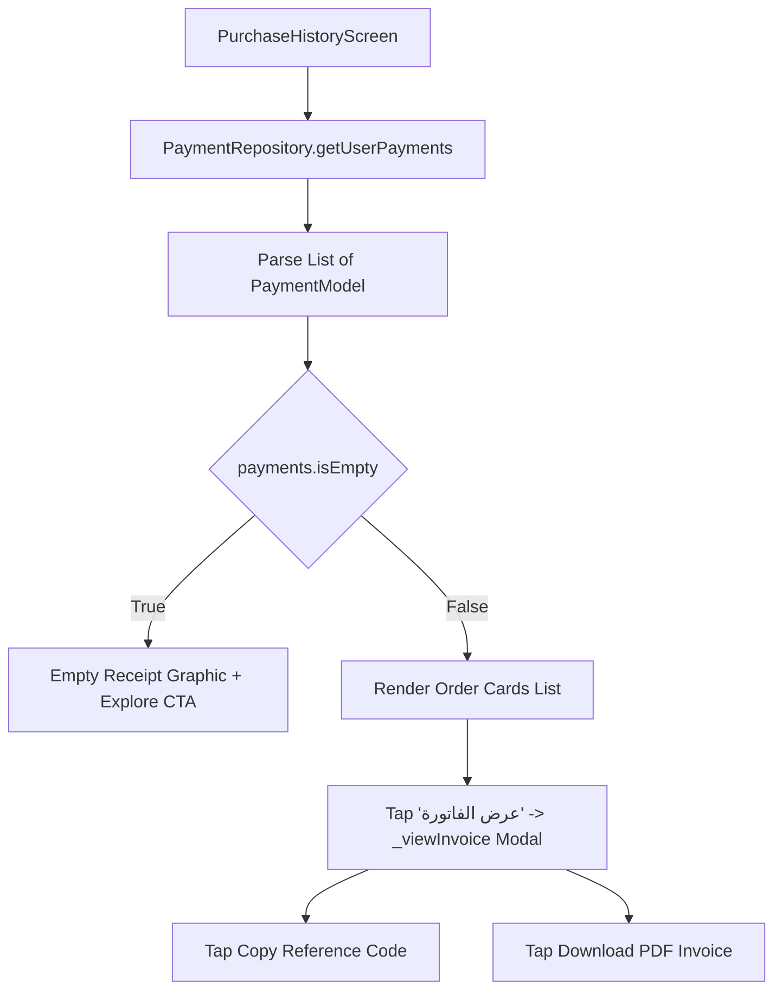

# Mobile Screen Deep-Dive: `PurchaseHistoryScreen`

> **File Path:** [`apps/mobile/lib/features/profile/presentation/screens/purchase_history_screen.dart`](file:///d:/Programming/MonoRepo%20Porjects/EducationLab/apps/mobile/lib/features/profile/presentation/screens/purchase_history_screen.dart)  
> **Route Name:** `'/purchase-history'`  
> **Scale:** 761 lines of Dart code  
> **State Management:** `PaymentRepository`  
> **Backend Integration:** `/api/Payment/my-payments`  
> **Key Features:** Interactive Digital Invoices, Multi-Card Receipts, PDF Export Links

---

## 1. Overview & Business Objective

`PurchaseHistoryScreen` provides learners with an audit log of past course orders, invoices, and payment receipts.

Key capabilities:
1. **Financial Order Logging:** Displays historical orders sorted chronologically with status indicators (Successful, Refunded, Pending).
2. **Interactive Digital Invoice Modal (`_viewInvoice`):** Bottom sheet modal presenting a breakdown of purchased courses, unit prices, tax components, payment card brand logo (`VISA`, `Mastercard`), and masked PAN (`•••• 4242`).
3. **Reference Identifier Copying:** Instant clipboard copying of transaction reference codes (`EDU-...` / `pi_...`).
4. **Receipt PDF Exporting:** Fast launcher for downloading official taxation receipts.

---

## 2. Screen Architecture & State Machine



---

## 3. UI Component Hierarchy & Layout Tree

```
Scaffold (backgroundColor: dynamic dark/light)
├── AppBar
│   ├── Leading: Localized back button
│   └── Title: "سجل المشتريات والفواتير" / "Purchase History"
└── Body: RefreshIndicator (Pull-to-Refresh: _loadPayments)
    └── AnimatedSwitcher
        ├── State A (Loading): Skeleton Shimmer Cards List
        ├── State B (Empty): Empty Orders Illustration + "لا توجد فواتير سابقة"
        └── State C (Data): ListView.builder (padding: 16)
            └── Order Card:
                ├── Top Row: Order ID (EDU-...) + Status Badge (Paid: Green / Refunded: Gray)
                ├── Date Row: Calendar Icon + Localized Date String
                ├── Courses Included Mini-List (Thumbnails & Titles)
                ├── Bottom Row:
                │   ├── Total Paid Price (Bold Tajawal with currency)
                │   └── TextButton: "عرض الفاتورة" -> _viewInvoice(item)
```

---

## 4. Method Catalog & Action Handlers

| Method Name | Signature | Lines | Description & Mutations |
| :--- | :--- | :--- | :--- |
| `_loadPayments` | `Future<void> _loadPayments() async` | [:32-49](file:///d:/Programming/MonoRepo%20Porjects/EducationLab/apps/mobile/lib/features/profile/presentation/screens/purchase_history_screen.dart#L32-L49) | Sets `_isLoading = true`, queries `/api/Payment/my-payments`, populates `_payments`, and handles error snackbars. |
| `_viewInvoice` | `void _viewInvoice(PaymentModel item)` | [:52-160](file:///d:/Programming/MonoRepo%20Porjects/EducationLab/apps/mobile/lib/features/profile/presentation/screens/purchase_history_screen.dart#L52-L160) | Opens a styled bottom sheet with order metadata, itemized courses, and payment method details. |

---

## 5. Security & Edge Case Resilience

1. **Cardholder Privacy:**
   * Full credit card numbers are never stored or rendered. The UI presents only masked suffixes (`•••• 4242`) provided by the server.
