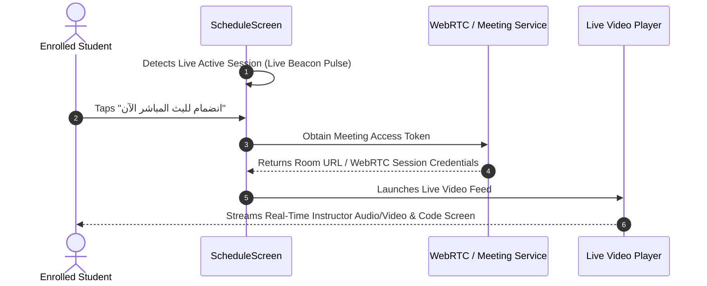

# Mobile Screen Deep-Dive: `ScheduleScreen`

> **File Path:** [`apps/mobile/lib/features/courses/presentation/screens/schedule_screen.dart`](file:///d:/Programming/MonoRepo%20Porjects/EducationLab/apps/mobile/lib/features/courses/presentation/screens/schedule_screen.dart)  
> **Route Name:** `'/schedule'`  
> **Scale:** 80 lines of Dart code  
> **Scope:** Live Mentorship Sessions, Office Hours, Real-Time Q&A Broadcasts

---

## 1. Overview & Business Objective

`ScheduleScreen` acts as the live classroom and academic timetable center for enrolled students. It coordinates real-time interactive lectures, professor office hours, and technical live coding sessions.

Key capabilities:
1. **Live Broadcast Status Indicator:** Animated red beacon dot (`مباشر الآن`) signaling actively streaming instructor sessions.
2. **Real-Time Attendance Headcount:** Displays live connected student counts (e.g. "142 طالب متصل").
3. **One-Tap Meeting Join:** Direct launcher button connecting students to live video rooms (Zoom, Google Meet, or proprietary WebRTC streams).
4. **Upcoming Timetable:** Chronological schedule of forthcoming group reviews and mentoring meetings.

---

## 2. Screen Architecture & Component Tree

```
Scaffold (backgroundColor: dynamic dark/light)
├── AppBar
│   ├── Leading: Back button
│   └── Title: "الجدول واللقاءات الحية" / "Live Schedule & Q&A"
└── Body: ListView (padding: 16)
    └── Active Live Stream Card (Red accent border):
        ├── Beacon Row: Red Dot + "مباشر الآن" (Live Now)
        ├── Title: Session Subject (e.g. "جلسة إرشاد ومراجعة كود Flutter Live Q&A")
        ├── Instructor & Attendees Row: "المدرب: م. إبراهيم الخالدي • 142 طالب متصل"
        └── Action Button:
            └── ElevatedButton.icon: "انضمام للبث المباشر الآن" (Video call icon)
```

---

## 3. Real-Time Broadcast Integration & Architecture



---

## 4. UI Rendering Details & Edge Cases

1. **Live Beacon Animation:**
   - Active sessions are framed in a high-visibility container with a red border (`Colors.redAccent.withValues(alpha: 0.6)`) and an attention-drawing indicator dot (`CircleAvatar(radius: 4, backgroundColor: Colors.red)`).
2. **Dynamic RTL Navigation:**
   - Leading app bar icon automatically flips between `Icons.arrow_forward_rounded` (Arabic RTL) and `Icons.arrow_back_rounded` (English LTR).
   - Safe route popping checks `Navigator.of(context).canPop()`; if false, cleanly replaces route with `'/main'`.
