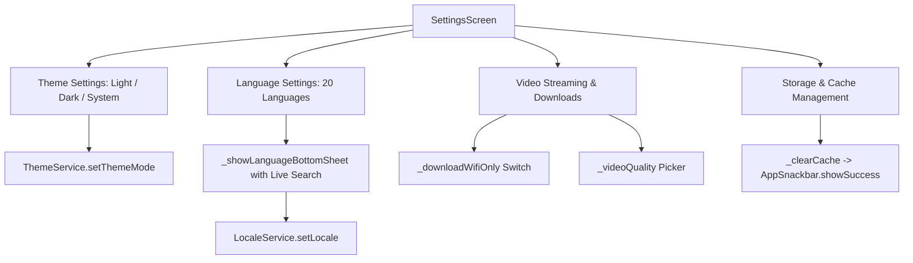

# Mobile Screen Deep-Dive: `SettingsScreen`

> **File Path:** [`apps/mobile/lib/features/profile/presentation/screens/settings_screen.dart`](file:///d:/Programming/MonoRepo%20Porjects/EducationLab/apps/mobile/lib/features/profile/presentation/screens/settings_screen.dart)  
> **Route Name:** `'/settings'`  
> **Scale:** 969 lines of Dart code  
> **State Management:** `ThemeService`, `LocaleService`  
> **Features:** 20 Language Selector Bottom Sheet, Theme Mode Toggling, Video Quality Settings, Cache Management

---

## 1. Overview & Business Objective

`SettingsScreen` is the central preferences console of EducationLab, providing granular control over UI localization, accessibility themes, streaming resolutions, and storage management.

Key features:
1. **20-Language Localization Engine:** Custom bottom sheet (`_showLanguageBottomSheet`) with live search filtering, native country flags, and instantaneous layout directionality switching (LTR/RTL).
2. **Dynamic Theme Switcher:** Light Mode, Dark Mode, or System Auto-Match powered by `ThemeService`.
3. **Video Playback & Offline Download Preferences:** Configuration for video resolution (1080p, 720p, 480p, Auto) and a "Wi-Fi Only" download toggle preventing accidental cellular data consumption.
4. **Notification Preference Switches:** Independent toggles for academic push notifications and promotional marketing alerts.
5. **Storage Cache Eviction:** Fast client-side cache clearing (`_clearCache`) freeing disk space without invalidating active sessions.

---

## 2. Screen Architecture & State Machine



---

## 3. UI Component Hierarchy & Layout Tree

```
Scaffold (backgroundColor: dynamic dark/light)
├── AppBar
│   ├── Leading: Localized back button
│   └── Title: "الإعدادات العامة" / "Settings"
└── Body: ListView (BouncingScrollPhysics, padding: 16)
    ├── SECTION 1: Appearance & Display
    │   ├── Group Container:
    │   │   ├── ListTile: "المظهر والسمة" (Theme Mode: Light / Dark / System)
    │   │   └── ListTile: "لغة التطبيق" (Current Language & Flag) -> _showLanguageBottomSheet()
    ├── SECTION 2: Video Playback & Downloads
    │   ├── Group Container:
    │   │   ├── SwitchListTile: "تنزيل المحتوى عبر Wi-Fi فقط" (_downloadWifiOnly)
    │   │   └── ListTile: "دقة تشغيل الفيديو الافتراضية" (_videoQuality: 1080p, 720p, etc.)
    ├── SECTION 3: Notifications Preferences
    │   ├── Group Container:
    │   │   ├── SwitchListTile: "إشعارات الدورات والتحديثات" (_pushNotifications)
    │   │   └── SwitchListTile: "العروض الترويجية والخصومات" (_promoNotifications)
    ├── SECTION 4: Storage & Maintenance
    │   ├── Group Container:
    │   │   └── ListTile: "مسح الذاكرة المؤقتة" (Cache Clear) -> _clearCache()
    └── SECTION 5: About & Legal
        ├── Group Container:
        │   ├── ListTile: "شروط الاستخدام وسياسة الخصوصية" -> /legal-content
        │   └── ListTile: "إصدار التطبيق" (e.g. "v1.2.4 (Build 42)")
```

---

## 4. Method Catalog & Action Handlers

| Method Name | Signature | Lines | Description & Mutations |
| :--- | :--- | :--- | :--- |
| `_clearCache` | `void _clearCache()` | [:47-53](file:///d:/Programming/MonoRepo%20Porjects/EducationLab/apps/mobile/lib/features/profile/presentation/screens/settings_screen.dart#L47-L53) | Evicts image and network caches with medium haptic feedback and displays a success toast. |
| `_showLanguageBottomSheet` | `void _showLanguageBottomSheet(BuildContext context)` | [:55-120](file:///d:/Programming/MonoRepo%20Porjects/EducationLab/apps/mobile/lib/features/profile/presentation/screens/settings_screen.dart#L55-L120) | Renders a modal sheet with search input filtering across 20 languages by code, native name, or English name; switches locale via `LocaleService`. |

---

## 5. Security & Edge Case Resilience

1. **Locale Persistence:**
   * Selecting a language writes to persistent device storage (`SharedPreferences`) immediately, ensuring the chosen language persists upon cold restarts.
2. **Instant Font & Layout Adaptation:**
   * Switching between Arabic and other languages triggers `WidgetsBinding` to swap fonts between `Tajawal` (Arabic) and `Inter` (Latin scripts) dynamically without restarting the app.
