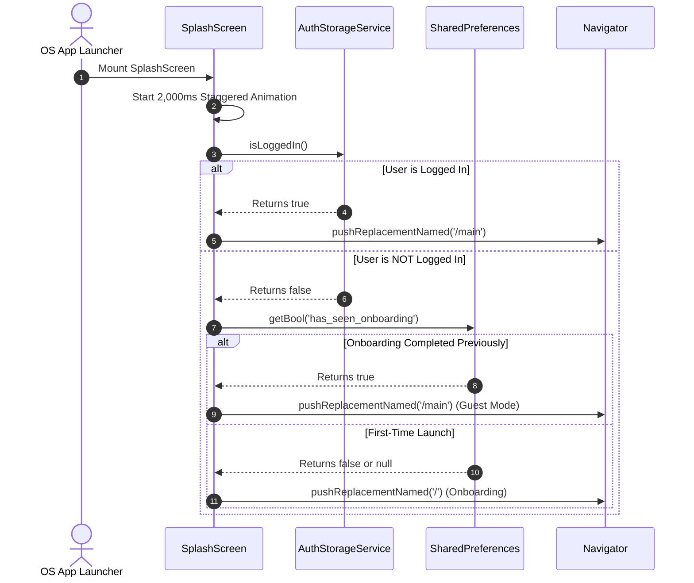

# Mobile Screen Deep-Dive: `SplashScreen`

> **File Path:** [`apps/mobile/lib/features/splash/presentation/screens/splash_screen.dart`](file:///d:/Programming/MonoRepo%20Porjects/EducationLab/apps/mobile/lib/features/splash/presentation/screens/splash_screen.dart)  
> **Route Name:** Initial entry route in `MaterialApp`  
> **Scale:** 229 lines of Dart code  
> **State Management:** `AuthStorageService`, `SharedPreferences`  
> **Animation Engine:** Staggered Multi-Interval Choreography (2,000ms duration)

---

## 1. Overview & Business Objective

`SplashScreen` is the application entry point and cold-boot bootstrapper. It coordinates visual branding animations while concurrently verifying local cryptographic session tokens and onboarding completion flags.

Key capabilities:
1. **Staggered Multi-Stage Animation:** A single 2,000ms `AnimationController` drives 5 coordinated animation intervals:
   * `_circleFade` (0.0 - 0.4): Radial circle fade-in.
   * `_circleScale` (0.0 - 0.5): Brand badge spring scale with `Curves.easeOutBack`.
   * `_titleFade` (0.25 - 0.6): Platform title cross-fade.
   * `_taglineFade` (0.4 - 0.75): Educational tagline reveal.
   * `_spinnerFade` (0.65 - 1.0): Loading spinner emergence.
2. **Deterministic Routing Decision Matrix:**
   * **Rule 1 (Authenticated):** If `AuthStorageService.isLoggedIn()` is `true`, immediately replaces route with `'/main'` (5 tabs active).
   * **Rule 2 (Returning Guest):** If `has_seen_onboarding` is `true`, immediately replaces route with `'/main'` (4 tabs active in guest mode).
   * **Rule 3 (First Launch):** If `has_seen_onboarding` is `false` or missing, replaces route with `'/'` ([`OnboardingScreen`](file:///d:/Programming/MonoRepo%20Porjects/EducationLab/Documentation/Modules/Mobile/Screens/OnboardingScreen.md)).

---

## 2. Bootstrapping Flow & Sequence



---

## 3. UI Component Hierarchy & Layout Tree

```
Scaffold (backgroundColor: const Color(0xFFFFFEFB))
└── Stack
    ├── Ambient Radial Orb 1 (Top-start decorative glow)
    ├── Ambient Radial Orb 2 (Bottom-end decorative glow)
    └── Center: Column
        ├── ScaleTransition (_circleScale)
        │   └── FadeTransition (_circleFade)
        │       └── Brand Logo Graphic Container with Shadow
        ├── SizedBox(height: 24)
        ├── FadeTransition (_titleFade)
        │   └── Title: "منصة إديولاب" (Bold 24px, Tajawal)
        ├── SizedBox(height: 8)
        ├── FadeTransition (_taglineFade)
        │   └── Tagline: "بوابتك للتعلم الذكي وبناء المستقبل"
        ├── SizedBox(height: 48)
        └── FadeTransition (_spinnerFade)
            └── AppLoadingSpinner
```

---

## 4. Security & Boot Hygiene

1. **Route Replacement Guarantee:**
   * Every navigation path uses `pushReplacementNamed`, completely destroying the `SplashScreen` widget from the navigation stack. The user can never press back to return to the splash screen.
2. **Mount State Verification:**
   * Every asynchronous step checks `if (!mounted) return;` before calling `setState` or accessing `Navigator`, avoiding memory leaks or exceptions during premature app closes.
