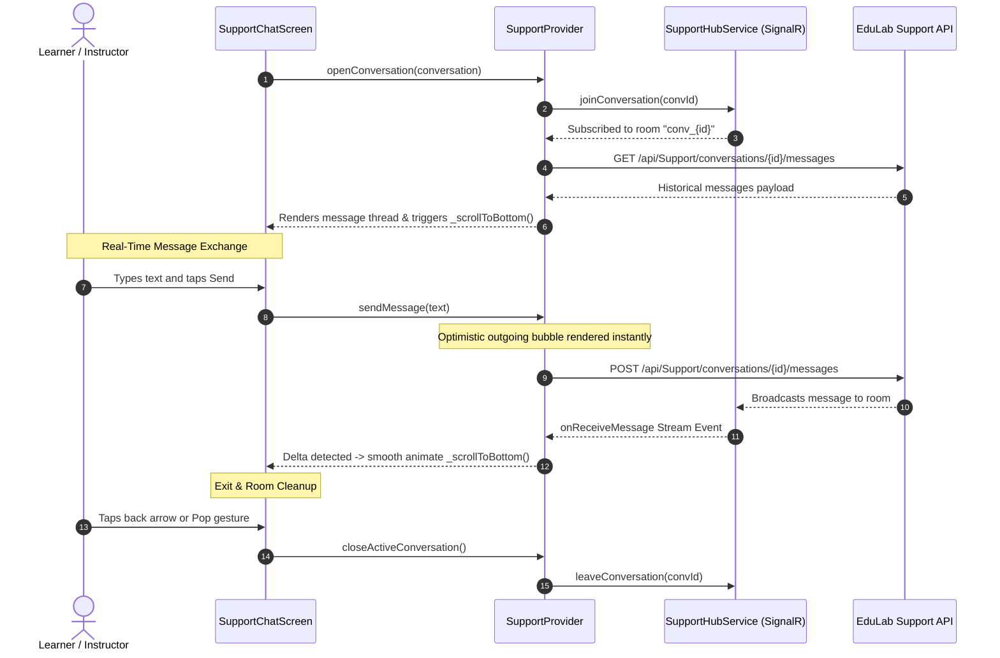

# Mobile Screen Deep-Dive: `SupportChatScreen`

> **File Path:** [`apps/mobile/lib/features/inbox/presentation/screens/support_chat_screen.dart`](file:///d:/Programming/MonoRepo%20Porjects/EducationLab/apps/mobile/lib/features/inbox/presentation/screens/support_chat_screen.dart)  
> **Route Name:** `'/support-chat'`  
> **Scale:** 696 lines of Dart code  
> **State Management:** `SupportProvider`, `SupportHubService` (SignalR WebSockets)  
> **Protocol:** Real-time bi-directional WebSockets + REST API fallback (`/api/Support`)

---

## 1. Overview & Business Objective

`SupportChatScreen` provides learners and instructors with an immediate, real-time customer support channel directly inside the mobile app. It connects mobile users to EducationLab helpdesk agents via an ASP.NET Core SignalR WebSocket hub.

Key features include:
1. **Real-Time WebSocket Streaming:** Real-time bi-directional message synchronization powered by `SupportHubService`, receiving live agent replies without polling.
2. **Room Channel Lifecycle:** Dynamically invokes `JoinConversation(conversationId)` upon opening the screen and automatically invokes `LeaveConversation(conversationId)` when navigating away.
3. **Ticket Lifecycle Administration:** Real-time ticket status monitoring (Open vs Closed) with green/gray status pills, dialog confirmations for closure, and instant re-opening capabilities.
4. **Smart Auto-Scrolling Engine:** Detects message list deltas (`messages.length != _lastMessageCount`) and smoothly animates the viewport to the latest incoming chat bubble.
5. **Context-Aware Message Bubbles:** Renders distinct visual styles for student messages versus verified support staff replies with timestamps and delivery badges.

---

## 2. Screen Architecture & State Machine



### 2.1 State Variables Registry

| Variable Name | Type | Lines | Initial Value | Scope & Lifecycle Purpose |
| :--- | :--- | :--- | :--- | :--- |
| `widget.conversation` | `SupportConversationModel` | [:10](file:///d:/Programming/MonoRepo%20Porjects/EducationLab/apps/mobile/lib/features/inbox/presentation/screens/support_chat_screen.dart#L10) | Required Arg | Active ticket data model (id, subject, status, createdAt, assignedAgent). |
| `_textController` | `TextEditingController` | [:19](file:///d:/Programming/MonoRepo%20Porjects/EducationLab/apps/mobile/lib/features/inbox/presentation/screens/support_chat_screen.dart#L19) | Empty | Controls message drafting input; cleared immediately upon send tap. |
| `_scrollController` | `ScrollController` | [:20](file:///d:/Programming/MonoRepo%20Porjects/EducationLab/apps/mobile/lib/features/inbox/presentation/screens/support_chat_screen.dart#L20) | `ScrollController()` | Controls chat list viewport position for programmatic auto-scroll. |
| `_focusNode` | `FocusNode` | [:21](file:///d:/Programming/MonoRepo%20Porjects/EducationLab/apps/mobile/lib/features/inbox/presentation/screens/support_chat_screen.dart#L21) | `FocusNode()` | Coordinates keyboard focus on message input bar. |
| `_lastMessageCount` | `int` | [:22](file:///d:/Programming/MonoRepo%20Porjects/EducationLab/apps/mobile/lib/features/inbox/presentation/screens/support_chat_screen.dart#L22) | `0` | Delta tracking tracker triggering auto-scroll whenever new messages arrive. |

---

## 3. UI Component Hierarchy & Layout Tree

```
PopScope (canPop: true, onPopInvokedWithResult: provider.closeActiveConversation)
└── Scaffold (backgroundColor: dynamic dark/light)
    ├── AppBar
    │   ├── Leading: Back button (triggers closeActiveConversation + pop)
    │   ├── Title: Column
    │   │   ├── Ticket Subject (bold, max 1 line with ellipsis)
    │   │   └── Row: Live Status Dot (Green: Open / Gray: Closed) + Status Label
    │   └── Actions:
    │       └── PopupMenuButton or Toggle Status Icon (Close/Reopen Ticket)
    └── Body: Column
        ├── Closed Ticket Banner (Conditional: !isOpen)
        │   └── "تم إغلاق هذه التذكرة. اضغط لإعادة فتحها"
        ├── Expanded: ListView.builder (ScrollController: _scrollController)
        │   └── Message Bubble:
        │       ├── Student Outgoing Bubble:
        │       │   ├── Alignment: End (Right in LTR, Left in RTL)
        │       │   ├── Background: AppColors.primary
        │       │   ├── White Body Text
        │       │   └── Formatted Timestamp + Sent Checkmark Icon
        │       └── Support Agent Incoming Bubble:
        │           ├── Alignment: Start
        │           ├── Surface Container with Subtle Border
        │           ├── Agent Badge: Headset Icon + "فريق الدعم"
        │           ├── Dark/Light TextPrimary Body
        │           └── Formatted Timestamp
        └── Bottom Message Input Bar (Conditional: enabled if isOpen)
            ├── TextField with Hint: "اكتب رسالتك هنا..."
            └── Send Action Button:
                ├── Circular Primary Container
                └── Send Icon Button -> triggers _sendMessage()
```

---

## 4. Method Catalog & Action Handlers

| Method Name | Signature | Lines | Description & Mutations |
| :--- | :--- | :--- | :--- |
| `_scrollToBottom` | `void _scrollToBottom({bool animate = true})` | [:40-55](file:///d:/Programming/MonoRepo%20Porjects/EducationLab/apps/mobile/lib/features/inbox/presentation/screens/support_chat_screen.dart#L40-L55) | Schedules post-frame execution ensuring `_scrollController` animates to `maxScrollExtent` with 250ms easeOut curve. |
| `_sendMessage` | `Future<void> _sendMessage() async` | [:57-66](file:///d:/Programming/MonoRepo%20Porjects/EducationLab/apps/mobile/lib/features/inbox/presentation/screens/support_chat_screen.dart#L57-L66) | Reads and clears `_textController`, calls `SupportProvider.sendMessage(text)`, and fires `_scrollToBottom()` on success. |
| `_formatTime` | `String _formatTime(DateTime dt, bool isArabic)` | [:68-76](file:///d:/Programming/MonoRepo%20Porjects/EducationLab/apps/mobile/lib/features/inbox/presentation/screens/support_chat_screen.dart#L68-L76) | Converts UTC timestamp to device local timezone and formats as localized 12-hour string (`hh:mm a`). |
| `_confirmToggleStatus` | `void _confirmToggleStatus(...)` | [:78-216](file:///d:/Programming/MonoRepo%20Porjects/EducationLab/apps/mobile/lib/features/inbox/presentation/screens/support_chat_screen.dart#L78-L216) | Renders a dialog with red lock badge confirming whether the student wants to close the active support ticket. |

---

## 5. Security & Real-Time Connection Resilience

1. **WebSocket Reconnection & Fallback:**
   * If the mobile device experiences transient packet loss or network handover (e.g. WiFi to Cellular), `SupportHubService` automatically triggers exponential backoff reconnection.
   * In the event of persistent WebSocket failure, `SupportProvider` seamlessly falls back to standard HTTP REST polling via `/api/Support/conversations/{id}/messages`.
2. **Channel Isolation & Privacy:**
   * SignalR hub authorization is enforced using the student's JWT bearer token. The backend hub strictly prevents users from joining conversation rooms that belong to other user accounts.
3. **Resource & Listener Hygiene:**
   * `PopScope` guarantees that regardless of how the user navigates away (AppBar back button, Android system back gesture, or notification tap), `provider.closeActiveConversation()` is executed. This halts incoming stream listeners and leaves the SignalR channel, preventing background memory leaks.
