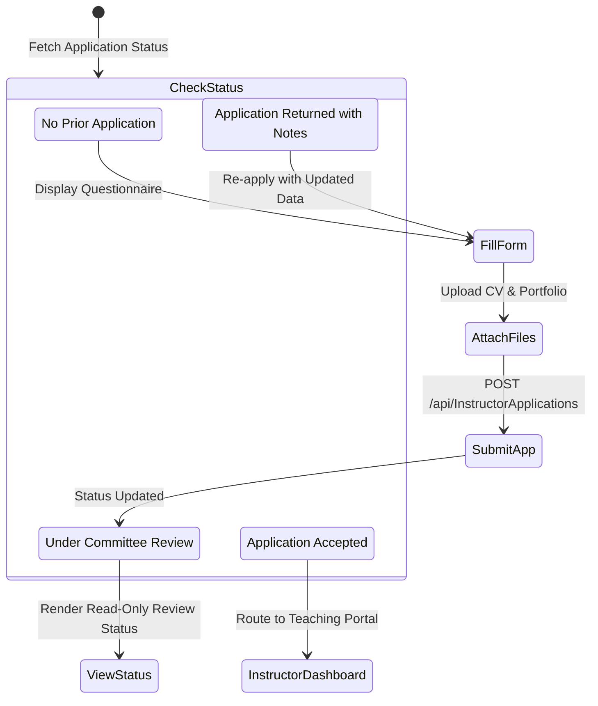

# Mobile Screen Deep-Dive: `TeachApplicationScreen`

> **File Path:** [`apps/mobile/lib/features/profile/presentation/screens/teach_application_screen.dart`](file:///d:/Programming/MonoRepo%20Porjects/EducationLab/apps/mobile/lib/features/profile/presentation/screens/teach_application_screen.dart)  
> **Route Name:** `'/teach-application'`  
> **Scale:** 1,940 lines of Dart code  
> **State Management:** `TeachApplicationProvider`, `ProfileProvider`  
> **Features:** Multi-Step Instructor Recruitment, Document & CV Attachment Upload, Application Status Tracker

---

## 1. Overview & Business Objective

`TeachApplicationScreen` is the academic recruitment portal of EducationLab. It manages the onboarding pipeline for prospective instructors, transforming registered students or industry professionals into accredited course instructors.

Key capabilities:
1. **Multi-Section Candidate Questionnaire:** Collects academic degrees, professional specializations, past teaching experience, sample video URLs, and proposed course syllabuses.
2. **File & Resume Attachment Engine:** Custom modal sheet (`_showImagePickerSheet`) enabling camera captures, gallery image uploads, and PDF resume attachments.
3. **Application Lifecycle Monitoring:** Renders interactive status banners based on candidate's application state:
   * **غير مقدم (Not Submitted):** Interactive editable multi-step application form.
   * **قيد المراجعة (Pending Review):** Read-only summary with animated clock badge and expected review timeframe.
   * **مقبول (Approved):** Congratulations banner unlocking instructor teaching controls.
   * **مرفوض (Rejected):** Feedback notice detailing administrator comments and a re-application CTA.
4. **Draft Auto-Population:** Pre-fills basic information (name, email, phone, bio) directly from the candidate's existing `ProfileModel`.

---

## 2. Screen Architecture & State Machine



---

## 3. UI Component Hierarchy & Layout Tree

```
Scaffold (backgroundColor: dynamic dark/light)
├── AppBar
│   ├── Leading: Back button
│   └── Title: "انضم كمعلم" / "Teach on EduLab"
└── Body: SingleChildScrollView (BouncingScrollPhysics, padding: 20)
    ├── SECTION 1: Program Benefits & Motivation Banner
    │   ├── Trophy & Earnings Icon
    │   ├── "شارك شغفك وعلم آلاف الطلاب حول العالم"
    │   └── Platform Perks: Global Reach, 80% Revenue Share, Marketing Support
    ├── SECTION 2: Application Status Card (if status != null)
    │   ├── Status Pill (Pending: Yellow / Approved: Green / Rejected: Red)
    │   └── Admin Feedback & Submission Timestamp
    └── SECTION 3: Multi-Step Application Form (if status == null or rejected)
        ├── Personal & Academic Background:
        │   ├── Full Name & Contact Phone
        │   ├── Highest Degree (Bachelor, Master, PhD, Certified Pro)
        │   └── University / Institution Name
        ├── Teaching & Industry Expertise:
        │   ├── Primary Specialty (Software Engineering, AI, Business, etc.)
        │   ├── Years of Experience Dropdown
        │   └── Prior Teaching Portals (YouTube, Coursera, Universities)
        ├── Course Proposal & Sample:
        │   ├── Proposed First Course Title
        │   ├── Target Audience & Key Learning Outcomes
        │   └── Sample Lecture Video Link (YouTube / Vimeo / Google Drive)
        ├── Documents & Attachments:
        │   ├── CV / Resume Attachment Box (Tap to pick file)
        │   └── Professional Headshot Photo Box
        └── Submit Action:
            └── AppButton: "إرسال طلب الانضمام" (Loading spinner during upload)
```

---

## 4. Method Catalog & Action Handlers

| Method Name | Signature | Lines | Description & Mutations |
| :--- | :--- | :--- | :--- |
| `_showImagePickerSheet` | `void _showImagePickerSheet(...)` | [:37-120](file:///d:/Programming/MonoRepo%20Porjects/EducationLab/apps/mobile/lib/features/profile/presentation/screens/teach_application_screen.dart#L37-L120) | Displays camera vs gallery sheet for headshot photo or document picker. |
| `_submitApplication` | `void _submitApplication() async` | Custom | Validates form fields, uploads attached CV multipart file, and submits payload to `/api/InstructorApplications`. |

---

## 5. Security & Edge Case Resilience

1. **File Type & Size Sanitization:**
   * Validates document file extensions (PDF, DOCX, JPG, PNG) and caps upload size at 10MB to prevent server-side exhaustion.
2. **Prevent Duplicate Submissions:**
   * Disables submit controls when an application is already in the `Pending` state, preventing redundant duplicate records.
