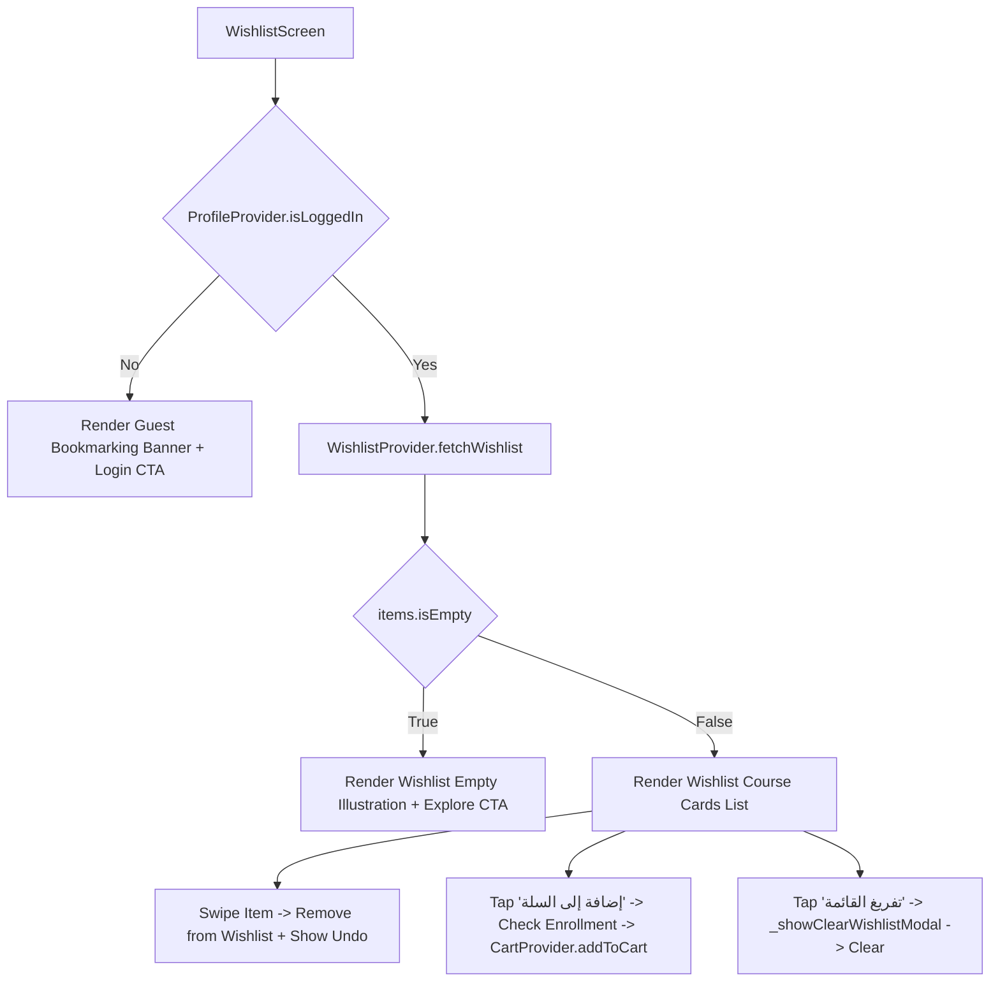

# Mobile Screen Deep-Dive: `WishlistScreen`

> **File Path:** [`apps/mobile/lib/features/wishlist/presentation/screens/wishlist_screen.dart`](file:///d:/Programming/MonoRepo%20Porjects/EducationLab/apps/mobile/lib/features/wishlist/presentation/screens/wishlist_screen.dart)  
> **Route Name:** `'/wishlist'`  
> **Scale:** 1,312 lines of Dart code  
> **State Management:** `WishlistProvider`, `CartProvider`, `EnrollmentProvider`, `ProfileProvider`  
> **Backend Synchronization:** `/api/Wishlist` (get, add, remove, clear)

---

## 1. Overview & Business Objective

`WishlistScreen` provides learners with a personal bookmarking repository for aspirational educational courses. It minimizes abandonment and converts interest into enrollment through streamlined cart transfers and undo-capable dismissals.

Key capabilities:
1. **Interactive Cart Migration (`_handleAddToCart`):** Converts bookmarked courses into active cart orders in a single tap, performing enrollment validation and providing an "انتقل إلى السلة" snackbar action.
2. **Swipe-to-Dismiss with Instant Undo:** Allows users to swipe away unwanted bookmarks while providing a transient "تراجع" (Undo) action banner to immediately restore deleted items.
3. **Double-Purchase Protection:** Checks `EnrollmentProvider.isEnrolled(courseId)` and disables purchasing actions if the student already owns the syllabus.
4. **Batch Wishlist Clearing:** A red-accented confirmation modal preventing accidental complete wishlist wipeouts.
5. **Guest State Fallback:** Dedicated welcome view with login CTAs when visited without an active session.

---

## 2. Screen Architecture & State Machine



---

## 3. UI Component Hierarchy & Layout Tree

```
Scaffold (backgroundColor: dynamic dark/light)
├── AppBar
│   ├── Leading: Localized back button
│   ├── Title: "قائمة الرغبات" / "Wishlist"
│   └── Actions: Trash Can Icon (Clear All - visible when items > 0)
└── Body: RefreshIndicator (Pull-to-Refresh: fetchWishlist)
    └── Column
        ├── Items Count Header (e.g. "لديك 5 دورات محفوظة")
        └── Expanded: ListView.builder
            └── Dismissible Wishlist Card:
                ├── Background: Red swipe container with trash icon
                └── Card Surface:
                    ├── Course Cover Image (CachedNetworkImage + Shimmer)
                    ├── Rating Stars & Reviews Count
                    ├── Course Title (Bold Tajawal) & Instructor Name
                    ├── Price Row: Original Price (Strikethrough) vs Discounted Price
                    └── Actions Row:
                        ├── Primary Button: "إضافة إلى السلة" -> _handleAddToCart()
                        └── Secondary Icon: Remove Trash Icon -> _handleRemove()
```

---

## 4. Method Catalog & Action Handlers

| Method Name | Signature | Lines | Description & Mutations |
| :--- | :--- | :--- | :--- |
| `_handleRemove` | `void _handleRemove(WishlistItemModel item) async` | [:32-46](file:///d:/Programming/MonoRepo%20Porjects/EducationLab/apps/mobile/lib/features/wishlist/presentation/screens/wishlist_screen.dart#L32-L46) | Medium haptic impact, removes item from `WishlistProvider`, and presents snackbar with undo action if course is not already enrolled. |
| `_handleAddToCart` | `void _handleAddToCart(WishlistItemModel item) async` | [:48-79](file:///d:/Programming/MonoRepo%20Porjects/EducationLab/apps/mobile/lib/features/wishlist/presentation/screens/wishlist_screen.dart#L48-L79) | Validates enrollment status, checks if item is already in cart, adds to `CartProvider`, and displays snackbar with direct navigation to `/cart`. |
| `_showClearWishlistModal` | `Future<void> _showClearWishlistModal(int count)` | [:81-160](file:///d:/Programming/MonoRepo%20Porjects/EducationLab/apps/mobile/lib/features/wishlist/presentation/screens/wishlist_screen.dart#L81-L160) | Displays confirmation modal sheet. On confirmation, invokes `WishlistProvider.clearWishlist()`. |

---

## 5. Security & Edge Case Resilience

1. **Double-Purchase Prevention:**
   * If a user taps "إضافة إلى السلة" on an already enrolled course, the app blocks the action with `context.loc.courseDetailsAlreadyEnrolled`, preventing redundant payments.
2. **Undo Action Safety:**
   * Tapping "تراجع" executes `WishlistProvider.addToWishlist(courseId)` optimistically, restoring the item immediately in memory while syncing with the backend.
