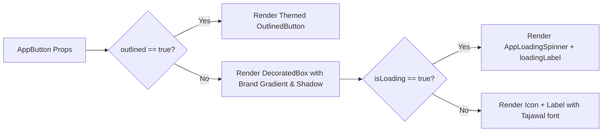

# Mobile UI Components & Design System Reference

> **Directory:** `apps/mobile/lib/core/widgets/` & `apps/mobile/lib/features/*/presentation/widgets/`  
> **Typography:** Tajawal (Arabic) / Inter (Latin)  
> **Colors:** Brand Primary `#1D61E7`, Dark Background `#0F172A`, Surface `#1E293B`

This document serves as the design system catalog for reusable visual components and feature-specific widgets across the EducationLab Flutter mobile application.

---

## 1. Core Design System Components

### 1.1 `AppButton`
**File:** [`apps/mobile/lib/core/widgets/app_button.dart`](file:///d:/Programming/MonoRepo%20Porjects/EducationLab/apps/mobile/lib/core/widgets/app_button.dart)

A highly versatile button with built-in tactile haptic feedback, gradient fills, and integrated asynchronous loading spinners.

#### Properties:
| Parameter | Type | Default | Description |
| :--- | :--- | :--- | :--- |
| `label` | `String` | required | Button text. |
| `onPressed` | `VoidCallback?` | required | Click callback (disabled if null or `isLoading`). |
| `isLoading` | `bool` | `false` | Displays spinner and disables user taps. |
| `loadingLabel`| `String?` | `null` | Optional replacement text during async operations. |
| `icon` | `Widget?` | `null` | Leading icon widget. |
| `height` | `double` | `52.0` | Container height (touch target standard). |
| `borderRadius`| `double` | `14.0` | Rounded corner radius. |
| `gradient` | `Gradient?` | Primary gradient | Custom gradient (defaults to `#1D61E7` -> `#2563EB`). |
| `outlined` | `bool` | `false` | Switches button to outlined border style. |
| `elevation` | `bool` | `true` | Enables subtle brand-colored drop shadow. |

---

### 1.2 `AppNetworkImage`
**File:** [`apps/mobile/lib/core/widgets/app_network_image.dart`](file:///d:/Programming/MonoRepo%20Porjects/EducationLab/apps/mobile/lib/core/widgets/app_network_image.dart)

Safe image rendering component wrapping `cached_network_image` with automated URL prefixing, shimmering placeholder, and error fallback emblems.
- **Key Features:**
  - Calls `ApiConstants.formatImageUrl(...)` to automatically resolve relative server paths (e.g. `/Images/thumbnails/abc.jpg` -> `https://edulabapi.runasp.net/Images/...`).
  - Renders `AppShimmer` during network download.
  - Displays graceful broken-image placeholder on 404 or transport errors without crashing the widget tree.

---

### 1.3 `AppShimmer` & `AppSkeleton`
**Files:** [`app_shimmer.dart`](file:///d:/Programming/MonoRepo%20Porjects/EducationLab/apps/mobile/lib/core/widgets/app_shimmer.dart) & [`skeleton/app_skeleton.dart`](file:///d:/Programming/MonoRepo%20Porjects/EducationLab/apps/mobile/lib/core/widgets/skeleton/app_skeleton.dart)

Provides smooth 60fps bone skeleton animations during initial screen loads:
- **`AppShimmer`**: Implements continuous gradient sweep animation with automatic light/dark palette adaptation (light: `#E2E8F0` -> `#F1F5F9`; dark: `#1E293B` -> `#334155`).
- **`SkeletonTemplates`**: Pre-composed skeleton layouts for:
  - Course Card Skeleton (thumbnail, title bone, instructor bone, price bone).
  - Curriculum Section Skeleton (expanding tiles).
  - Profile Header Skeleton.

---

### 1.4 `AppStates`: `AppEmptyState` & `AppErrorState`
**File:** [`apps/mobile/lib/core/widgets/app_states.dart`](file:///d:/Programming/MonoRepo%20Porjects/EducationLab/apps/mobile/lib/core/widgets/app_states.dart)

Declarative full-screen and container-level state indicators:
- **`AppEmptyState`**: Centered circular emblem with icon, explanatory message, and optional retry/action button. Used in empty cart, empty wishlist, and zero search results.
- **`AppErrorState`**: Danger-themed error indicator with localized error message and retry callback (`onRetry`).

---

## 2. Feature-Specific Presentation Widgets

### 2.1 Course Card (`HomeCourseCard` & `ExploreCourseCard`)
**Files:** [`home_course_card.dart`](file:///d:/Programming/MonoRepo%20Porjects/EducationLab/apps/mobile/lib/features/home/presentation/widgets/home_course_card.dart) & [`explore_course_card.dart`](file:///d:/Programming/MonoRepo%20Porjects/EducationLab/apps/mobile/lib/features/catalog/presentation/widgets/explore_course_card.dart)
- Displays course thumbnail with aspect ratio 16:9.
- Status badge chip (`"الأعلى مبيعاً"`, `"الأعلى تقييماً"`, `"جديد"`).
- Star rating badge with total reviews counter.
- Instructor avatar and name.
- Price and original discounted price with strike-through styling.
- Heart icon allowing instant wishlist bookmarking.

### 2.2 Mini Player & Floating Learning Bar (`ContinueLearningMiniBar`)
- Rendered on the Home and Learning screens when an active enrollment has pending progress.
- Features dynamic linear progress bar, remaining lesson count, and one-tap `"متابعة"` button jumping directly into `LessonPlayerScreen`.

### 2.3 Support Chat Bubbles (`SupportMessageBubble`)
- Differentiates user messages (right-aligned, primary blue background, white text) from support staff / admin replies (left-aligned, card surface background, themed text).
- Includes message delivery timestamp and checkmark status.

### 2.4 User Profile Header (`UserProfileHeader`)
**File:** [`user_profile_header.dart`](file:///d:/Programming/MonoRepo%20Porjects/EducationLab/apps/mobile/lib/features/profile/presentation/widgets/user_profile_header.dart)
- Circular profile image with camera badge for instant photo updating.
- Verified learner/instructor checkmark badge.
- Email and account creation date.
- Quick navigation shortcuts into user certificates and order invoices.
