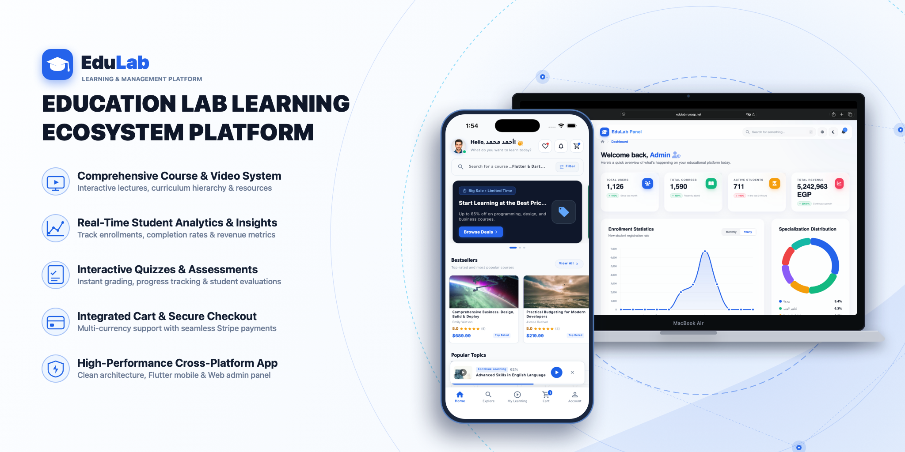

<div align="center">

  

  <br/><br/>

  [](https://dotnet.microsoft.com)
  [](https://dotnet.microsoft.com/apps/aspnet/mvc)
  [](https://flutter.dev)
  [](https://dart.dev)
  [](#-monorepo-architecture)
  [](https://www.microsoft.com/sql-server)
  [](https://stripe.com)
  [](https://dotnet.microsoft.com/apps/aspnet/signalr)
  [](https://edulab.runasp.net/scalar/v1)

  <p align="center">
    <b>A modern, enterprise-grade multi-platform Learning Management System (LMS) monorepo. Featuring a high-throughput .NET 9.0 Clean Architecture REST API, an ASP.NET Core MVC Admin & Instructor Portal, and a production-grade Flutter Mobile Application (iOS & Android).</b>
  </p>

  <p align="center">
    <a href="#-monorepo-architecture">Monorepo Architecture</a> •
    <a href="#-applications--subsystems">Subsystems</a> •
    <a href="#-core-platform-features">Features</a> •
    <a href="#-technology-stack">Tech Stack</a> •
    <a href="#-quick-start--setup">Getting Started</a> •
    <a href="#-api-documentation">API Docs</a> •
    <a href="#-author--contact">Author</a>
  </p>

</div>

---

## 🏛️ Monorepo Architecture

EduLab is structured as an enterprise monorepo with strict decoupling between the core domain services, web portal, and client applications:

```
EduLab Monorepo/
├── apps/
│   ├── api/                    # 🚀 Backend Core REST API (.NET 9.0 Clean Architecture)
│   │   ├── EduLab_Domain/      # Enterprise business entities, domain events, specifications
│   │   ├── EduLab_Application/ # Use cases, DTOs, CQRS/Service interfaces, validations
│   │   ├── EduLab_Infrastructure/ # EF Core 9 Data Access, SQL Server, Stripe, MailKit
│   │   ├── EduLab_API/         # API controllers, JWT/OAuth handlers, SignalR Hubs
│   │   └── EduLab.Tests/       # Unit & Integration test suites
│   │
│   ├── web/                    # 🌐 Web Application Portal (ASP.NET Core MVC 9.0)
│   │   └── EduLab_MVC/         # Admin, Instructor & Learner views, Tailwind CSS
│   │
│   └── mobile/                 # 📱 Mobile Application (Flutter & Dart SDK ^3.11.0)
│       ├── lib/                # Feature-First Clean Architecture (AR/EN RTL/LTR)
│       └── test/               # 60+ Unit, Widget & State test suites
│
├── Documentation/              # 📚 Technical module specifications & API blueprints
└── EduLab Project.sln          # Visual Studio solution file
```

---

## 📱 Subsystems & Applications

<table>
  <tr>
    <td width="33%" valign="top">
      <h3 align="center">🚀 Backend API</h3>
      <p align="center"><b>.NET 9.0 RESTful API</b></p>
      <ul>
        <li>Domain-Driven Clean Architecture</li>
        <li>JWT Bearer & OAuth 2.0 (Google/FB)</li>
        <li>Entity Framework Core 9 Code-First</li>
        <li>Bidirectional <b>SignalR Support Hub</b></li>
        <li>Stripe.net Payment webhook processing</li>
        <li>Scalar interactive API documentation</li>
      </ul>
      <p align="center">
        <a href="./apps/api"><b>Explore API &rarr;</b></a>
      </p>
    </td>
    <td width="33%" valign="top">
      <h3 align="center">🌐 Web Portal</h3>
      <p align="center"><b>ASP.NET Core MVC 9.0</b></p>
      <ul>
        <li>Comprehensive <b>Admin Dashboard</b></li>
        <li>Instructor course authoring & curriculum</li>
        <li>Real-time revenue & student analytics</li>
        <li>Role-based access control (Claims)</li>
        <li>Tailwind CSS + Responsive glassmorphism</li>
        <li>Multi-lingual localization (AR / EN)</li>
      </ul>
      <p align="center">
        <a href="./apps/web"><b>Explore Web &rarr;</b></a>
      </p>
    </td>
    <td width="33%" valign="top">
      <h3 align="center">📱 Mobile App</h3>
      <p align="center"><b>Flutter 3.x (iOS & Android)</b></p>
      <ul>
        <li>Feature-First Clean Architecture</li>
        <li>Immersive multi-bitrate video player</li>
        <li>Hardware keychain token encryption</li>
        <li>Stripe 3D Secure checkout</li>
        <li>Live SignalR support chat</li>
        <li>Full RTL (Arabic) & LTR (English) mirroring</li>
      </ul>
      <p align="center">
        <a href="./apps/mobile"><b>Explore Mobile &rarr;</b></a>
      </p>
    </td>
  </tr>
</table>

---

## 🌟 Core Platform Features

- 🔐 **Unified Authentication & Security**: JWT bearer tokens, Refresh token rotation, Two-Factor Auth (2FA), and Social Logins (Google & Facebook).
- 🎓 **Rich Curriculum & Course Management**: Multi-module lessons, video streaming progress tracking, quizzes, and downloadable resources.
- 💳 **Complete E-Commerce & Checkout**: Dynamic shopping cart, real-time coupons, and **Stripe 3D Secure (SCA)** card processing.
- 🏆 **Cryptographic Certificate Verification**: Verified digital course completion certificates with scannable QR verification endpoints.
- 💬 **Real-Time Live Support (SignalR)**: Low-latency live messaging between learners and support admins via WebSockets.
- 🔔 **Intelligent Cloud Notifications**: Firebase Cloud Messaging (FCM) + scheduled device alerts.
- 🌍 **Enterprise Bilingual Theming**: Automatic Arabic (RTL) and English (LTR) layout switching with Slate Dark/Light mode tokens.

---

## 🛠️ Technology Stack

| Domain | Technology | Description |
|:---|:---|:---|
| **Backend Framework** | .NET 9.0 / C# 13 | High-performance enterprise REST API |
| **Web Framework** | ASP.NET Core MVC 9.0 | Server-rendered portal with Tailwind CSS |
| **Mobile Framework** | Flutter 3.x / Dart 3.x | Cross-platform native iOS & Android app |
| **Database & ORM** | SQL Server + EF Core 9.0 | Relational storage with automated migrations |
| **Real-Time Engine** | SignalR Core WebSockets | Real-time bidirectional support hub |
| **Payment Gateway** | Stripe API (Stripe.net) | 3D Secure 2.0 card tokenization & payments |
| **Security & Auth** | ASP.NET Core Identity + JWT | Multi-provider authentication with 2FA |
| **API Documentation** | Scalar + OpenAPI | Modern interactive API documentation |
| **Push Notifications** | Firebase Cloud Messaging (FCM) | Cross-platform push notifications |
| **Email Service** | MailKit / MimeKit | Transactional SMTP notification engine |

---

## 🚀 Quick Start & Setup

### 1. Prerequisites
- [.NET 9.0 SDK](https://dotnet.microsoft.com/download/dotnet/9.0)
- [Flutter SDK](https://docs.flutter.dev/get-started/install) (`^3.11.0`)
- [SQL Server](https://www.microsoft.com/sql-server) or SQL Server Express
- Visual Studio 2022 / VS Code with C# Dev Kit & Flutter extensions

---

### 2. Backend & Database Setup

```bash
# 1. Restore all .NET dependencies across the monorepo
dotnet restore "EduLab Project.sln"

# 2. Configure connection string in apps/api/EduLab_API/appsettings.json

# 3. Apply database migrations
cd apps/api/EduLab_API
dotnet ef database update

# 4. Run the Backend REST API
dotnet run --project EduLab_API.csproj
```

---

### 3. Web Portal Setup

```bash
# Navigate to the MVC web project and run
cd apps/web/EduLab_MVC
dotnet run --project EduLab_MVC.csproj
```

---

### 4. Mobile Application Setup

```bash
# Navigate to mobile project
cd apps/mobile

# Get Flutter dependencies
flutter pub get

# Run test suites (60+ passing tests)
flutter test

# Launch on simulator or physical device
flutter run
```

---

## 📖 API Documentation

The REST API includes interactive API documentation powered by **Scalar**. When the backend is running:

```text
https://edulab.runasp.net/scalar/v1
```

---

## 🧪 Quality Assurance & Testing

```bash
# Run all .NET Backend test suites
dotnet test "EduLab Project.sln"

# Run all Flutter Mobile test suites with coverage
cd apps/mobile && flutter test --coverage
```

---

## 👨‍💻 Author & Contact

Developed with dedication by **Mohamed Gasser**

<p align="left">
  <a href="https://www.linkedin.com/in/mohamedgasser15" target="_blank">
    
  </a>
  <a href="https://github.com/MohamedGasser15" target="_blank">
    
  </a>
</p>

---

<div align="center">
  <sub>Built for students, educators, and enterprise learning ecosystems. © 2026 EduLab Monorepo. All rights reserved.</sub>
</div>
