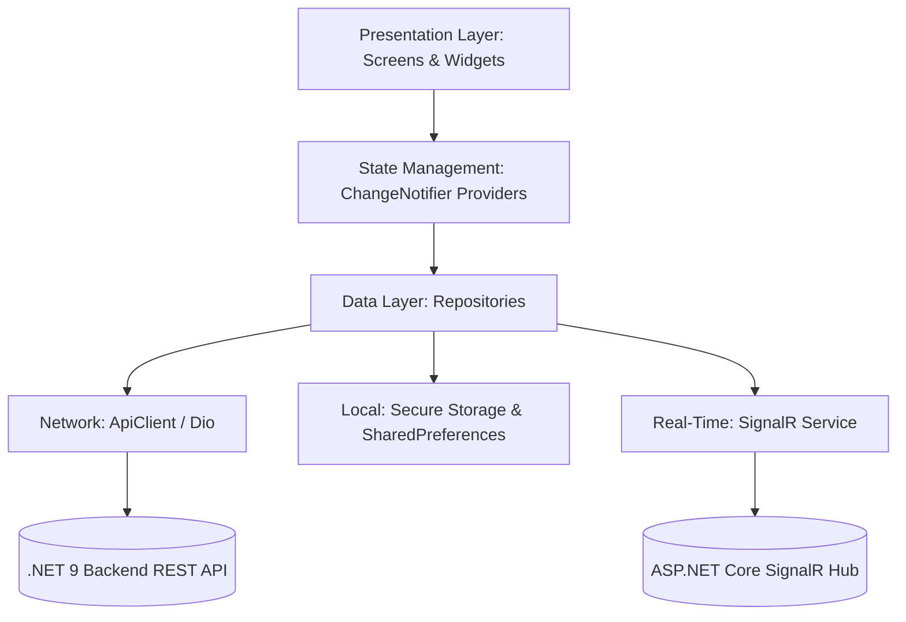

<div align="center">

  

  <br/><br/>

  [](https://flutter.dev)
  [](https://dart.dev)
  [](#-architecture--design-patterns)
  [](#-tech-stack--dependencies)
  [](https://dotnet.microsoft.com)
  [](https://stripe.com)
  [](#-real-time-support--push-notifications)
  [](#-testing--code-quality)

  <p align="center">
    <b>An enterprise-grade, high-performance Learning Management System (LMS) mobile application built with Flutter. Engineered with Clean Architecture, Real-Time SignalR WebSockets, Stripe Payments, Hardware-Encrypted Token Security, and Full Dual-Language (AR/EN) RTL/LTR Support.</b>
  </p>

  <p align="center">
    <a href="#-overview--vision">Overview</a> •
    <a href="#-key-features">Features</a> •
    <a href="#-architecture--design-patterns">Architecture</a> •
    <a href="#-ecosystem--backend-integration">Ecosystem & API</a> •
    <a href="#-performance--security-engineering">Security</a> •
    <a href="#-tech-stack--dependencies">Tech Stack</a> •
    <a href="#-getting-started">Getting Started</a> •
    <a href="#-author--contact">Author</a>
  </p>

</div>

---

## 📖 Overview & Vision

**EduLab** is a full-featured, cross-platform mobile educational ecosystem built for modern learners, instructors, and educational institutions. It seamlessly connects to a high-throughput **.NET 9.0 Clean Architecture REST API** and an **ASP.NET Core MVC Admin & Instructor Portal**, delivering a unified experience across mobile and web platforms.

```
                                  ┌───────────────────────────────┐
                                  │      EduLab Ecosystem         │
                                  └──────────────┬────────────────┘
                                                 │
                  ┌──────────────────────────────┼──────────────────────────────┐
                  ▼                              ▼                              ▼
      ┌───────────────────────┐      ┌───────────────────────┐      ┌───────────────────────┐
      │   Flutter Mobile App  │◄────►│   .NET 9.0 REST API   │◄────►│ ASP.NET Core MVC Web  │
      │   (iOS & Android)     │      │   (Domain / Services) │      │ (Admin & Instructor)  │
      └───────────────────────┘      └───────────┬───────────┘      └───────────────────────┘
                                                 │
                                 ┌───────────────┴───────────────┐
                                 ▼                               ▼
                     ┌───────────────────────┐       ┌───────────────────────┐
                     │   Stripe 3D Secure    │       │  SignalR Hub & WebSockets
                     └───────────────────────┘       └───────────────────────┘
```

---

## 🌟 Key Features

<table>
  <tr>
    <td width="50%" valign="top">
      <h3>🔐 Authentication & Security</h3>
      <ul>
        <li><b>Multi-Factor Auth</b>: Email/Password, 2FA, OTP verification, and JWT auto-refresh session rotation.</li>
        <li><b>Native Social Sign-in</b>: Direct OAuth 2.0 integration via <b>Google</b> & <b>Facebook</b> Graph API.</li>
        <li><b>Hardware Encryption</b>: Encrypted token storage in iOS Keychain and Android EncryptedSharedPreferences.</li>
      </ul>
    </td>
    <td width="50%" valign="top">
      <h3>📚 Immersive Course Player</h3>
      <ul>
        <li><b>Video Streaming & Progress</b>: Adaptive video streaming, automatic progress tracking, and lecture notes.</li>
        <li><b>Curriculum Hierarchy</b>: Modular course breakdown with downloadable lecture resources.</li>
        <li><b>Interactive Community</b>: Q&A discussions, instructor replies, and course reviews with star ratings.</li>
      </ul>
    </td>
  </tr>
  <tr>
    <td width="50%" valign="top">
      <h3>💳 E-Commerce & Stripe Checkout</h3>
      <ul>
        <li><b>Cart & Wishlist</b>: Instant cart syncing, coupon application, and tax breakdown.</li>
        <li><b>Stripe Integration</b>: End-to-end card tokenization with <b>3D Secure (SCA)</b> payment validation.</li>
        <li><b>Purchase History</b>: Detailed invoice logs with downloadable receipts.</li>
      </ul>
    </td>
    <td width="50%" valign="top">
      <h3>🏆 Certificates & Assessments</h3>
      <ul>
        <li><b>Digital Certificates</b>: View, share, and verify verified certificates with cryptographically signed QR codes.</li>
        <li><b>Interactive Quizzes</b>: Timed assignments, instant score feedback, and retake limits.</li>
      </ul>
    </td>
  </tr>
  <tr>
    <td width="50%" valign="top">
      <h3>💬 Real-Time Live Support</h3>
      <ul>
        <li><b>SignalR WebSockets</b>: Bidirectional live support chat with instant delivery and agent typing indicators.</li>
        <li><b>Connection Resilience</b>: Automatic retry policies and offline message queues.</li>
      </ul>
    </td>
    <td width="50%" valign="top">
      <h3>🌍 Localization & Theming</h3>
      <ul>
        <li><b>Bilingual Support</b>: Full <b>Arabic (RTL)</b> & <b>English (LTR)</b> layout mirroring with dynamic switching.</li>
        <li><b>Adaptive Theming</b>: Deep Slate <b>Dark Mode</b> and Crisp <b>Light Mode</b> with custom typography.</li>
      </ul>
    </td>
  </tr>
</table>

---

## 🏛️ Architecture & Design Patterns

EduLab is engineered following **Feature-First Clean Architecture**, ensuring strict separation of concerns, testability, and high maintainability across distributed engineering teams:



### 📂 Directory Structure

```text
lib/
├── core/                       # Core Foundation Layer
│   ├── constants/              # API endpoints, assets, admin claims & keys
│   ├── di/                     # Dependency Injection (GetIt Service Locator)
│   ├── extensions/             # String, Date, and Localization extensions
│   ├── repositories/           # Base abstract repositories
│   ├── services/               # ApiClient (Dio), Storage, Auth, Sounds, SignalR, FCM
│   ├── theme/                  # Design tokens, Dark/Light palettes & AppColors
│   ├── utils/                  # AppLogger (with PII sanitization), Responsive helpers
│   └── widgets/                # Reusable UI widgets (AppNetworkImage, AppButton, AppShimmer)
├── features/                   # Feature-Driven Business Modules
│   ├── auth/                   # Authentication (Login, Register, 2FA, OAuth)
│   ├── cart/                   # Cart, Checkout & Stripe Payment integration
│   ├── catalog/                # Explore, Filters, Search & Categories
│   ├── courses/                # Course details, Video player, Lessons, Reviews
│   ├── home/                   # Home feed, Top instructors, Promo banners
│   ├── inbox/                  # Push Notifications, Support Chat (SignalR)
│   ├── learning/               # My Courses, Enrollment, Progress tracking
│   ├── legal/                  # Privacy policy, Terms of service
│   ├── onboarding/             # App walkthrough & welcome flow
│   ├── profile/                # User profile, Instructor application, Security
│   └── wishlist/               # Wishlist management
├── l10n/                       # AR / EN Localization arb files
├── app.dart                    # App root, Theme & Route configuration
└── main.dart                   # Application bootstrap & background services init
```

---

## 🔌 Ecosystem & Backend Integration

The mobile application communicates with the unified **EduLab backend ecosystem**:

- **Interactive API Documentation**: Documented and testable via [Scalar API Docs](https://edulab.runasp.net/scalar/v1).
- **Web Admin & Instructor Portal**: Built on ASP.NET Core MVC 9.0 for course authoring, user permissions, and real-time revenue analytics.
- **SignalR Support Hub**: WebSocket communication with fallback long-polling for zero-drop messaging.
- **Stripe Integration**: Secure card tokenization and 3D Secure customer authentication.

---

## ⚡ Performance & Security Engineering

- 🔒 **PII-Sanitized Logging (`AppLogger`)**: Automatically scrubs passwords, credit card numbers, CVVs, and Bearer tokens from terminal and runtime logs.
- ⚡ **Zero-Latency Token Interceptor**: In-memory caching for JWT tokens and API configuration eliminates async disk I/O on every HTTP request.
- 🖼️ **Memory-Bounded Image Pipeline (`AppNetworkImage`)**: Uses `CachedNetworkImage` bounded with `memCacheWidth/Height` parameters, preventing memory spikes and Out-of-Memory (OOM) errors on image-heavy screens.
- 🔄 **Startup Lazy-Loading**: Avoids startup request storms by deferring heavy module initialization until required.

---

## 🛠️ Tech Stack & Dependencies

| Domain | Technology / Library | Purpose |
|:---|:---|:---|
| **Framework** | Flutter 3.x / Dart 3.x | Cross-platform mobile development |
| **Architecture** | Feature-First Clean Architecture | Scalable & maintainable codebase |
| **State Management** | `Provider` + `GetIt` | Separation of state and dependency resolution |
| **Networking** | `Dio` + Custom Interceptors | HTTP REST Client with auto-retry & token refresh |
| **Real-Time** | `SignalR NetCore Client` | WebSocket bidirectional live customer support |
| **Push Notifications** | `Firebase Cloud Messaging` + `flutter_local_notifications` | Push messaging and scheduled alerts |
| **Secure Storage** | `flutter_secure_storage` | Hardware Keychain (iOS) and Keystore (Android) |
| **Payment Gateway** | `Stripe API` | Secure 3D-Secure payment flow |
| **Testing** | `flutter_test` + `mockito` | 60+ Unit, Mock & Golden responsive tests |

---

## 🚀 Getting Started

### Prerequisites
- **Flutter SDK**: `^3.11.0` ([Install Flutter](https://docs.flutter.dev/get-started/install))
- **Android Studio / Xcode**: For mobile simulators and native compilation

### Quick Setup

```bash
# 1. Clone the repository
git clone https://github.com/MohamedGasser15/Education-Lab.git

# 2. Navigate to the mobile app directory
cd "Education Lab/apps/mobile"

# 3. Install packages
flutter pub get

# 4. Run unit and widget test suites
flutter test

# 5. Launch app on connected device / simulator
flutter run
```

### Production Release Builds

```bash
# Android App Bundle (AAB for Google Play)
flutter build appbundle --release

# Android Split APKs (Optimized per CPU architecture)
flutter build apk --split-per-abi --release

# iOS Release IPA
flutter build ipa --release
```

---

## 🧪 Testing & Code Quality

EduLab features comprehensive test coverage with **60+ test suites**:
- **Unit Tests**: API Clients, State Providers, Repositories, and Business logic.
- **Security Tests**: Token rotation, expiry handling, and PII masking.
- **Validation Tests**: Credit card algorithms, OTP, and input formatters.

```bash
# Run all tests with coverage report
flutter test --coverage
```

---

## 👨‍💻 Author & Contact

Developed with dedication by **Mohamed Gasser**

<p align="left">
  <a href="https://www.linkedin.com/in/mohamedgasser15" target="_blank">
    
  </a>
  <a href="https://github.com/MohamedGasser15" target="_blank">
    
  </a>
</p>

---

<div align="center">
  <sub>Built for students, educators, and enterprise learning ecosystems. © 2026 EduLab. All rights reserved.</sub>
</div>
